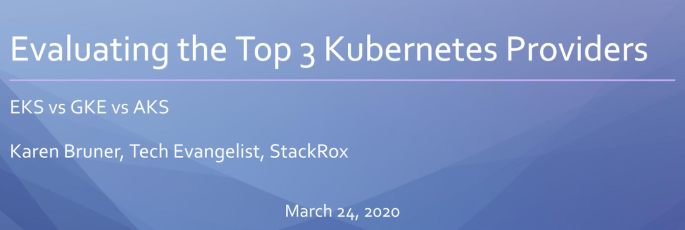
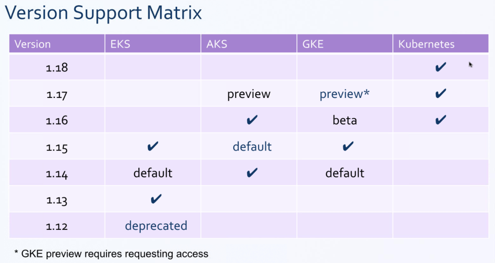
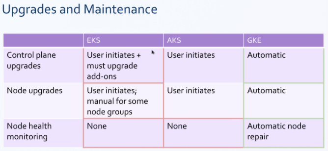
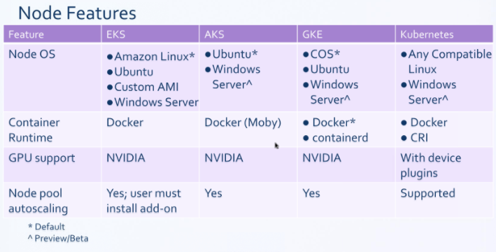
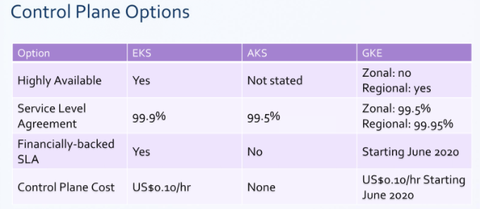
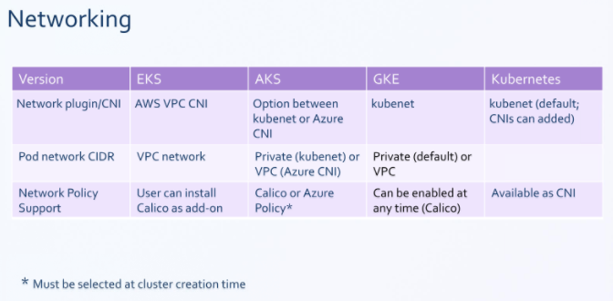
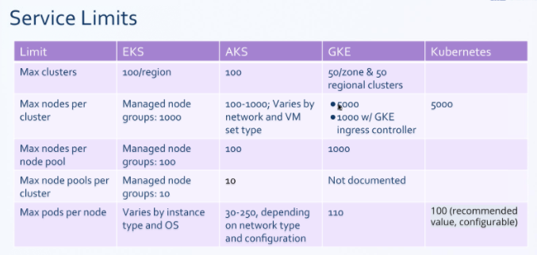
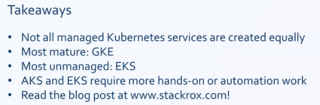

# Martes 24/03/2020

## WORK

- Azure container registry. https://github.com/vthot4/azure_lab/blob/master/LABs/Azure_container_Registry/readme.md
- Entornos de desarrollo para kubernetes.

## **(Book) The Phoenix Project**

**CHAPTER 12. Friday, September 12.**

William started sending back critical bug reports to the developers, many of whom had already gone home for the day. Chris had to call them back in, and William’s team had to wait for the developers to send them new versions.

One of the developers had actually walked in a couple of minutes ago and said, “Look, it’s running on my laptop. How hard can it be?”

I turn to Patty. “Go work with William to figure out how we can get some better traffic coordination in the releases. Get over to where the developers are and play air traffic controller, and make sure everything is labeled and versioned on their side. And then let Wes and team know what’s coming over. We need better visibility and someone to keep people following process over there. I want a single entry point for code drops, controlled hourly releases, documentation… Get my drift?”

**CHAPTER 13. Monday, September 15.**

*Nada interesante*

## Webinar

**Evaluating the Top Kubernetes Providers**
Muy interesantes las tablas comparativas entre los diferentes entornos de kuberentes en cloud.

