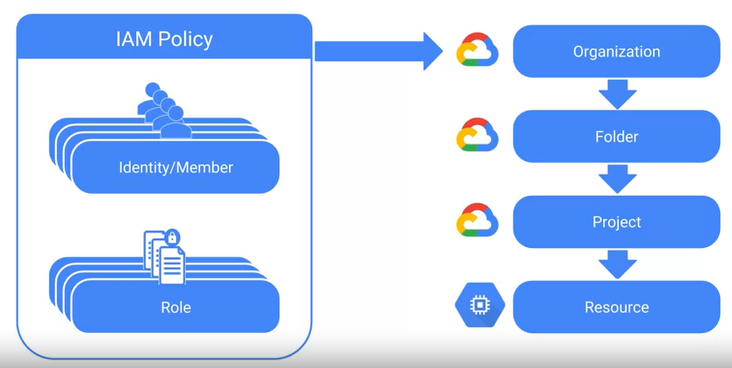
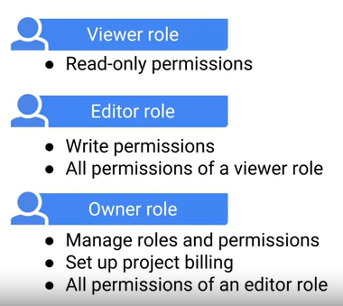
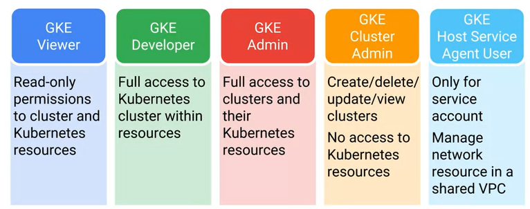

# **Architecting with Google Kubernetes Engine: Production**

**Inicio Curso: 11/04/2020**

**Fin Curso:**

## Authentication and Authorization

- In Kubernetes, there are two main types of users:
  - Normal users. --> Managed by Cloud IAM
  - Service accounts. --> Managed by Kubernetes

- API server authenticates in different ways:
  - OpenID Connect tokens.
  - x509 client certificates.
  - Staticpasswords.

## Cloud IAM

- Three elements are defined in Cloud IAM access control.

  - **who**, what and which. Who, refers to the identity of the person making the request. 
  - **What**, refers to the set of permissions that are granted, and which, 
  - refers to **which** resources this policy applies to. 

  In Cloud IAM, you grant access to members.

- A Cloud IAM policy is a list of bindings, and in each binding a set of members is bound to one or more roles. The IAM policy in turn can be attached to a specific resource, a project, a project folder, or a whole organization. GCP resources are organized hierarchically, starting with the organization. Within an organization, you can have multiple folders containing multiple projects and so on. An IAM policy attached at the organizational level will automatically have access to all folders, all projects, and ultimately all relevant resources. In this way, you can set up access control at any level within the organizational hierarchy and choose the most appropriate level for each IAM policy. Cloud IAM policies applied at higher levels of a GCP organizational hierarchy are inherited by resources lower down that hierarchy. 

  

- There are three kinds of roles in Cloud IAM, primitive, predefined, and custom. 

- Primitive roles are the first type of role. Primitive roles existed before the introduction of Cloud IAM but can still be used with Cloud IAM. These roles can be used to grant users global, project-level access to all GCP resources within a project. There are three primitive roles. The first primitive role, the Viewer role, permits read-only actions such as viewing existing resources or data across the whole project. Next, the Editor role. In addition to all of your permissions, the Editor role is allowed to modify existing resources. The final primitive role, the Owner role, has all of the editor permissions, plus has the right to manage roles and permissions and set up billing for a project. Any of these roles, since they are applied to a project, can access all resources such as App Engine, Compute Engine, and Cloud Storage within that project. Primitive roles are very broad.

  

- GKE predefined Cloud IAM roles provide granular access to Kubernetes resources.

  

- We can use custom roles where predefined roles are insufficient.

## Kubernetes RBAC

