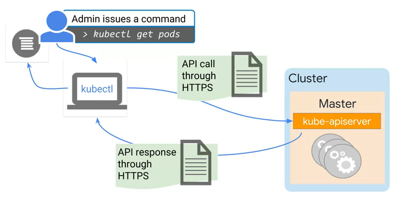
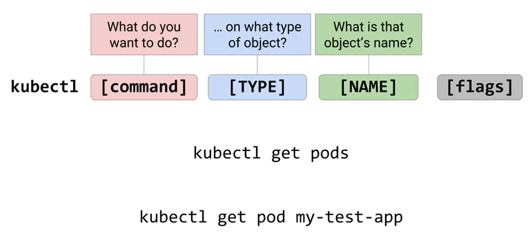
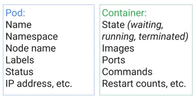
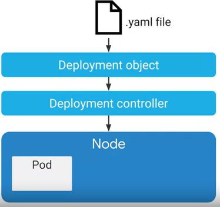
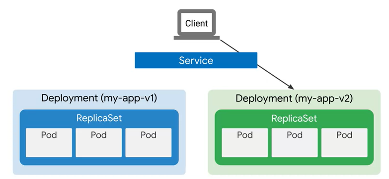
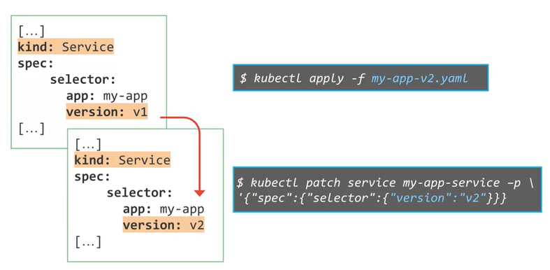

# Architecting with Google Kubernetes Engine: Workloads
**Fecha inicio: 08/04/2020**
**Fecha fin: **

## The kubectl command

- kubectl es una utilidad que utilizan los administradores para controlar los clústeres de Kubernetes.  Se utiliza para comunicarse con el comando kube-apiserver en su instancia principal. kubectl transfiere sus entradas de línea de comandos a llamadas a la API y las envía al kube-apiserver en el clúster de Kubernetes seleccionado.

- Using kubectl to see a list of Pods in a Cluster.

  

- Kubectl must be configured first.

  - Relies on a config file: $HOME/.kube/config
  - Config file contains:
    - Target cluster name
    - Credentials for the cluster
  - Current config:
    - kubectl config view

- Connecting to a Google Kubernetes Engine (GKE) cluster:

  ```bash
  $ gcloud container cluster get-credentials [CLUSTER_NAME] --zone [ZONE_NAME]
  ```

- Explaining kubectl syntax

  

```bash
$ kubectl get pod my-test-app -o=yaml
$ kubectl get pods -o=wide
```

- kubectl has many uses:
  - Create Kubernetes objects.
  - View objects.
  - Delete objects.
  - View and export configurations.

## Introspection

- La introspección es el acto de reunir información sobre contenedores pods, servicios y otros motores que se ejecutan dentro del clúster. 

- get - describe - exec - logs

  ```bash
  ## Getting a list of Pods
  $ kubectl get pods
  ## Pods phases
  	# Pending
  	# Running
  	# Successded
  	# Failed
  	# Unknown
  	# CrashLoopBackOff
  ```

  ```bash
  ## Decribing a Pod
  $ kubectl describe pod [POD_NAME]
  ```

  

  ```bash
  ## Running a command within a Pod
  $ kubectl exec -it [POD_NAME] -- [command]
  ```

  ```bash
  ## Getting logs for a Pod
  $ kubectl Logs [POD_NAME]
  ```


## LAB: Deploying Google Kubernetes Engine Cluster from Cloud Shell

Link de referencia: https://cloud.google.com/sdk/gcloud/reference/container/clusters/create

LAB [NOTAS](./Arc_Google_Kubernetes_Workloads/LAB_Deploying_Google_Kubernetes_Engine_Clusters_from_Cloud_Shell.md)


## Deployments

- Deployment is a two-part process.

  

- Deployment usage:

  - Roll out updates to the Pods.
  - Rool back Pods to previous revision.
  - Scale or autoscale Pods.
  - Well-suited for stateless applications.

- Deployment object file in YAML format:

  ```yaml
  apiVersion: apps/v1
  kind: Deployment
  metadata:
  	name: my-app
  spec:
  	replicas: 3
  	template:
  		metadata:
  			labels:
  				app: my-app
  		spec:
  			containers:
  			- name: my-app
  			  image: gcr.io/demo/my-app:1.0
  			  ports:
  			  - containerPort: 8080
  ```

- There are three ways to create a Deployment:

  ```bash
  ## 1 Use deployment file
  $ kubectl apply -f [DEPLOYMENT_FILE]
  
  ## 2 use kubectl run
  $ kubectl run [DEPLOYMENT_NAME] \
  	--image [IMAGE]:[TAG] \
  	--replicas 3 \
  	--labels [KEY]=[VALUE] \
  	--port 8080 \
  	--generator deployment/apps.v1 \
  	--save-config
  
  ## 3 Use GCP Console
  ```

- Use kubectl to inspect your Deployment

  ```bash
  $ kubectl get deployment [DEPLOYMENT_NAME]
  $ kubrcto describe deployment [DEPLOYMENT_NAME]
  ```

- Output the Deployment config in a YAML format

  ```bash
  kubectl get deployment [DEPLOYMENT_NAME] -o yaml > this.yaml
  ```

- Autoscaling a Deplyment.

  ```bash
  $ kubectl autoscale deployment [DEPLOYMENT_NAME] --min=5 --max=15 --cpu-percent=75 
  ```

  

- Trashing is a phenomenon where the number of deployed replicas frequently fluctuate because the metric we use to control scaling also frequently fluctuates. The horizontal pod auto-scaler supports a cool down or delay feature. it allows you to specify as a wait period  before performing another scale down action. The default value is five minutes.

  ```yaml
  --horizontal-pod-autoscaler-dowscale-delay
  ```

- Updating a Deployment

  ```bash
  $ kubectl apply -f [DEPLOYMENT_FILE]
  ```

  ```bash
  $ kubectl set image deployment [DEPLYMENT_NAME][IMAGE][IMAGE]:[TAG]
  ```

- In a rolling update strategy, the max unavailable and max search fields control how the pods are updated. These fields of final range for the total number of pods within the deployment regardless of replica sets. The max unavailable field lets you specify the maximum number of pods that can be unavailable during the rollout process. This number can either be absolute or a percentage.  

- An example of a rolling update strategy

  ```yaml
  [...]
  kind: deployment
  spec:
  	replicas: 10
  	strategy:
  		type: RollingUpdate
  		rollingUpdate:
  			maxSurge: 5
  			maxUnavialable: 30%
  [...]
  ```

- **Blue/green deployment** strategy. A blue/green deployment strategy is useful when you want to deploy a new version of an application, and also ensure that application services remain available while the deployment is updated. With the blue/green update strategy, a completely new deployment is created with a newer version of the application. In this case, it's my dash app dash v2. When the pods in the new deployment are ready, the traffic can be switched from the old blue version,  to the new green version.

  



- **Canary deployments.** The canary method is another update strategy based on the blue-green method but traffic is gradually shifted to the new version. The main advantages of using canary deployments are that you can minimize excess research usage during the update and because the roll-out is gradual, issues can be identified before they affect all instances of the application.

- Applying a canary deployment

  ```yaml
  [...]
  kind: Service
  spec:
  	selector:
  		app: my-app
  [...]
  ```

  ```bash
  $ kubectl apply -f my-app-v2.yaml
  $ kubectl scale deploy/my-app-v2 -replicas=10
  $ kubectl delete -f my-app-v1.yaml
  ```

- **Rolling back  Deployment.** You roll back using kubectl roll-out undo command. A simple roll-out undo command will revert the deployment to its previous revision. You roll back to a specific version by specifying the revision number. If you're not sure of the changes, you can expect the roll-out history using the kubectl roll-out history command. The GCP console doesn't have a direct role back feature. However, you can start Cloud Shell from your console and use these commands.

  ```bash
  $ kubectl rollout undo deployment [DEPLOYMENT_NAME]
  $ kubectl rollout undo deployment [DEPLOYMENT_NAME] --to-revision=2
  $ kubectl rollout history deployment [DEPLOYENT_NAME] --revision=2
  ```

  

- Deployment has three different lifecycle states. 

  - Progressing State. The deployments progressing state indicates that a task is being performed.
  - Complete State. complete state indicates that all the replicas have been updated to the latest version and are available and no old replicas are running.
  - Failed State. the failed state occurs when the creation of a new replica set could not be completed.

- When you edit a deployment, your action normally triggers an automatic rollout. But if you have an environment where small fixes are released frequently, you will have a large number of rollouts. In a situation like that, you'll find it more difficult to link issues with specific roll-outs. To help, you can temporarily pause these roll-outs by using the kubectl rollout pause command. The initial state of the deployment prior to pausing will continue its function. But new updates suite to the deployment will not have any effect where the rollout is paused. The changes will only be [inaudible] once a rollout is resumed. When you resume the rollout, all these new changes will be rolled out with a single revision. You can also monitor the rollout status by using the kubectl rollout status command.

  ```bash
  $ kubectl rollout pause deployment [DEPLOYMENT_NAME]
  $ kubectl rollout resume deployment [DEPLOYMENT_NAME]
  $ kubectl rollout status deployment [DEPLOYMENT_NAME]
  ```

- Deleting a Deployment

  ```bash
  $ kubectl delete deployment [DEPLOYMENT_NAME]
  ```

## LAB: Creating Google Kubernetes Engine Deployments

Notas del LAB [notas](./Arc_Google_Kubernetes_Workloads/LAB_Creating_Google_Kubernetes_Engine_Deployments.md)

