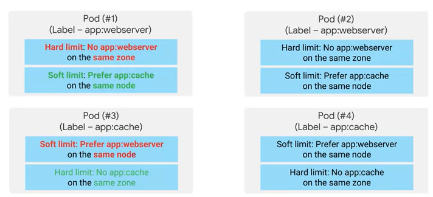
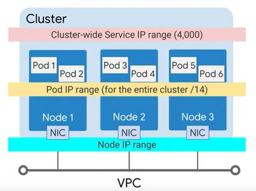
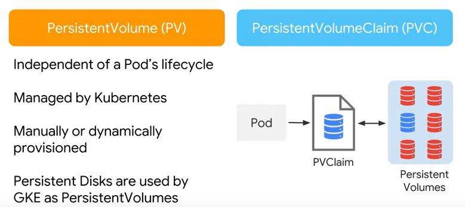

Architecting with Google Kubernetes Engine: Workloads

**Fecha inicio: 08/04/2020**
**Fecha fin:  10/04/2020**

## The kubectl command

- kubectl es una utilidad que utilizan los administradores para controlar los clústeres de Kubernetes.  Se utiliza para comunicarse con el comando kube-apiserver en su instancia principal. kubectl transfiere sus entradas de línea de comandos a llamadas a la API y las envía al kube-apiserver en el clúster de Kubernetes seleccionado.

- Using kubectl to see a list of Pods in a Cluster.

  

- Kubectl must be configured first.

  - Relies on a config file: $HOME/.kube/config
  - Config file contains:
    - Target cluster name
    - Credentials for the cluster
  - Current config:
    - kubectl config view

- Connecting to a Google Kubernetes Engine (GKE) cluster:

  ```bash
  $ gcloud container cluster get-credentials [CLUSTER_NAME] --zone [ZONE_NAME]
  ```

- Explaining kubectl syntax

  

```bash
$ kubectl get pod my-test-app -o=yaml
$ kubectl get pods -o=wide
```

- kubectl has many uses:
  - Create Kubernetes objects.
  - View objects.
  - Delete objects.
  - View and export configurations.

## Introspection

- La introspección es el acto de reunir información sobre contenedores pods, servicios y otros motores que se ejecutan dentro del clúster. 

- get - describe - exec - logs

  ```bash
  ## Getting a list of Pods
  $ kubectl get pods
  ## Pods phases
  	# Pending
  	# Running
  	# Successded
  	# Failed
  	# Unknown
  	# CrashLoopBackOff
  ```

  ```bash
  ## Decribing a Pod
  $ kubectl describe pod [POD_NAME]
  ```

  

  ```bash
  ## Running a command within a Pod
  $ kubectl exec -it [POD_NAME] -- [command]
  ```

  ```bash
  ## Getting logs for a Pod
  $ kubectl Logs [POD_NAME]
  ```


## LAB: Deploying Google Kubernetes Engine Cluster from Cloud Shell

Link de referencia: https://cloud.google.com/sdk/gcloud/reference/container/clusters/create

LAB [NOTAS](./Arc_Google_Kubernetes_Workloads/LAB_Deploying_Google_Kubernetes_Engine_Clusters_from_Cloud_Shell.md)


## Deployments

- Deployment is a two-part process.

  

- Deployment usage:

  - Roll out updates to the Pods.
  - Rool back Pods to previous revision.
  - Scale or autoscale Pods.
  - Well-suited for stateless applications.

- Deployment object file in YAML format:

  ```yaml
  apiVersion: apps/v1
  kind: Deployment
  metadata:
  	name: my-app
  spec:
  	replicas: 3
  	template:
  		metadata:
  			labels:
  				app: my-app
  		spec:
  			containers:
  			- name: my-app
  			  image: gcr.io/demo/my-app:1.0
  			  ports:
  			  - containerPort: 8080
  ```

- There are three ways to create a Deployment:

  ```bash
  ## 1 Use deployment file
  $ kubectl apply -f [DEPLOYMENT_FILE]
  
  ## 2 use kubectl run
  $ kubectl run [DEPLOYMENT_NAME] \
  	--image [IMAGE]:[TAG] \
  	--replicas 3 \
  	--labels [KEY]=[VALUE] \
  	--port 8080 \
  	--generator deployment/apps.v1 \
  	--save-config
  
  ## 3 Use GCP Console
  ```

- Use kubectl to inspect your Deployment

  ```bash
  $ kubectl get deployment [DEPLOYMENT_NAME]
  $ kubrcto describe deployment [DEPLOYMENT_NAME]
  ```

- Output the Deployment config in a YAML format

  ```bash
  kubectl get deployment [DEPLOYMENT_NAME] -o yaml > this.yaml
  ```

- Autoscaling a Deplyment.

  ```bash
  $ kubectl autoscale deployment [DEPLOYMENT_NAME] --min=5 --max=15 --cpu-percent=75 
  ```

  

- Trashing is a phenomenon where the number of deployed replicas frequently fluctuate because the metric we use to control scaling also frequently fluctuates. The horizontal pod auto-scaler supports a cool down or delay feature. it allows you to specify as a wait period  before performing another scale down action. The default value is five minutes.

  ```yaml
  --horizontal-pod-autoscaler-dowscale-delay
  ```

- Updating a Deployment

  ```bash
  $ kubectl apply -f [DEPLOYMENT_FILE]
  ```

  ```bash
  $ kubectl set image deployment [DEPLYMENT_NAME][IMAGE][IMAGE]:[TAG]
  ```

- In a rolling update strategy, the max unavailable and max search fields control how the pods are updated. These fields of final range for the total number of pods within the deployment regardless of replica sets. The max unavailable field lets you specify the maximum number of pods that can be unavailable during the rollout process. This number can either be absolute or a percentage.  

- An example of a rolling update strategy

  ```yaml
  [...]
  kind: deployment
  spec:
  	replicas: 10
  	strategy:
  		type: RollingUpdate
  		rollingUpdate:
  			maxSurge: 5
  			maxUnavialable: 30%
  [...]
  ```

- **Blue/green deployment** strategy. A blue/green deployment strategy is useful when you want to deploy a new version of an application, and also ensure that application services remain available while the deployment is updated. With the blue/green update strategy, a completely new deployment is created with a newer version of the application. In this case, it's my dash app dash v2. When the pods in the new deployment are ready, the traffic can be switched from the old blue version,  to the new green version.

  


- **Canary deployments.** The canary method is another update strategy based on the blue-green method but traffic is gradually shifted to the new version. The main advantages of using canary deployments are that you can minimize excess research usage during the update and because the roll-out is gradual, issues can be identified before they affect all instances of the application.

- Applying a canary deployment

  ```yaml
  [...]
  kind: Service
  spec:
  	selector:
  		app: my-app
  [...]
  ```

  ```bash
  $ kubectl apply -f my-app-v2.yaml
  $ kubectl scale deploy/my-app-v2 -replicas=10
  $ kubectl delete -f my-app-v1.yaml
  ```

- **Rolling back  Deployment.** You roll back using kubectl roll-out undo command. A simple roll-out undo command will revert the deployment to its previous revision. You roll back to a specific version by specifying the revision number. If you're not sure of the changes, you can expect the roll-out history using the kubectl roll-out history command. The GCP console doesn't have a direct role back feature. However, you can start Cloud Shell from your console and use these commands.

  ```bash
  $ kubectl rollout undo deployment [DEPLOYMENT_NAME]
  $ kubectl rollout undo deployment [DEPLOYMENT_NAME] --to-revision=2
  $ kubectl rollout history deployment [DEPLOYENT_NAME] --revision=2
  ```

  

- Deployment has three different lifecycle states. 

  - Progressing State. The deployments progressing state indicates that a task is being performed.
  - Complete State. complete state indicates that all the replicas have been updated to the latest version and are available and no old replicas are running.
  - Failed State. the failed state occurs when the creation of a new replica set could not be completed.

- When you edit a deployment, your action normally triggers an automatic rollout. But if you have an environment where small fixes are released frequently, you will have a large number of rollouts. In a situation like that, you'll find it more difficult to link issues with specific roll-outs. To help, you can temporarily pause these roll-outs by using the kubectl rollout pause command. The initial state of the deployment prior to pausing will continue its function. But new updates suite to the deployment will not have any effect where the rollout is paused. The changes will only be [inaudible] once a rollout is resumed. When you resume the rollout, all these new changes will be rolled out with a single revision. You can also monitor the rollout status by using the kubectl rollout status command.

  ```bash
  $ kubectl rollout pause deployment [DEPLOYMENT_NAME]
  $ kubectl rollout resume deployment [DEPLOYMENT_NAME]
  $ kubectl rollout status deployment [DEPLOYMENT_NAME]
  ```

- Deleting a Deployment

  ```bash
  $ kubectl delete deployment [DEPLOYMENT_NAME]
  ```

## LAB: Creating Google Kubernetes Engine Deployments

Notas del LAB [notas](./Arc_Google_Kubernetes_Workloads/LAB_Creating_Google_Kubernetes_Engine_Deployments.md)


## Job and Cronjobs

- A job is a Kubernetes object like a deployment. A job creates one or more pods to run a specific task reliably. In its simplest form, a job will create one pod and track the task completion within that pod. When the task is completed, it will terminate the pod and then report that the job has successfully finished.

- example: a non-parallel Job computing pi to 2000 places

  ```yaml
  apiVersion: bactch/v1
  kind: Job
  metadata:
  	name: pi
  spec:
  	template:
  		spec:
  			containers:
  			- name: pi
  			  iamge: perl
  			  command: ["perl", "MBignum=bpi", "-wle", "print bpi(2000)"]
  			restartPolicy: Never
  	backoffLimit: 4
  ```

  ```bash
  ## job with file
  $ kubectl apply -f [JOB_FILE]
  
  ## job
  $ kubectl run pi --image perl --restart Never -- perl -Mbignum bpi -wle 'print bpi(2000)'
  ```

  

- Where application failures are possible or expected, the backoff limit field can be used. Backoff limits specifies the number of retries before a job is considered to have failed entirely. The default is six. This allows you to halt jobs that would otherwise get stuck in a restart loop. Failed pods are recreated with an exponentially increasing delay: 10 seconds, 20 seconds, 40 seconds, and so on up to a maximum of six minutes.

- The parallel job type creates multiple pods that work on the same task at the same time. Parallel job types are specified by setting the spec.parallelism value for a job greater than one.

- There are two types of parallel jobs, one with a fixed task completion count, and the other which processes a work queue.

- Parallel Job with fixed completion count

  

- Parallel Job with a worker queue

  

- Inspecting a Job

  ```bash
  $ kubectl describe job [JOB_NAME]
  $ kubectl get pod -L [job-name=my-app-job]
  ```

- Scaling a Job

  ```bash
  $ kubectl scale job [JOB_NAME] -replicas [VALUE]
  ```

- Failing a Job

  ```yaml
  apiVersion: batch/v1
  kind: job
  metadata:
  	name: my-app-job
  spec:
  	backoffLimit: 4
  	activeDeadlineSeconds: 300
  	template:
  [...]
  ```

- Deleting Job

  ```bash
  $ kubectl delete -f [JOB_FILE]
  $ kubectl delete job [JOB_NAME]
  $ kubectl delete job [JOB_NAME] --cascade false
  ```

- Cron job is a Kubernetes object that creates jobs in repeatable manner to a defined schedule. Cron jobs are called that because they are named after Cron, the standard Unix Linux mechanism for scheduling a process. The schedule field except the time in the Unix Linux standard format for scheduling a Cron job.

- Setting up a cron schedule under the CronJob spec

  ```yaml
  apiVersion: batch/v1
  kind: CronJob
  metadata:
  	name: my-app-job
  spec:
  	schedule: "*/1 * * * *"
  	startingDeadlineSeconds: 3600
  	concurrencyPolicy: Forbid
  	suspend: True
  	successfulJobsHistoryLimit: 3
  	failedJobsHistoryLimit: 1
  	jobtemplate:
  		spec:
  			template:
  				spec:
  [...]
  ```

  The job template defines the job specification, just as I told you about in the previous lessons about jobs. If the job defined in this benefits is scheduled to start every minute, what happens if the job isn't started at the scheduled time? By default the Cron job looks at how many times the job has failed to run since it was last scheduled. If that failure count exceeds 100 and an error is logged and the job is not scheduled, this will prevent an error with a Cron job resulting in an endless accumulation of failed attempts overtime. This behavior can be controlled using the starting deadlines seconds value. Instead of looking at the number of failed attempts to run the jobs since it last successfully run, you can define the starting deadlines seconds attribute which defines a window of time to sum the number of failed attempts. Depending on how frequently jobs are scheduled and how long it takes to finish the define test, the Cron job might end up executing more than one job concurrently. You use the concurrency policy value to define whether concurrent executions are permitted. With the values allow, forbid, or replace. In the case of forbid, if the existing job hasn't finished the Cron job won't execute a new job. With replace, the existing job will be replaced by the new job. This policy only applies to jobs that were created using the same Cron job. Other Cron jobs in their jobs aren't considered or effected. You can stop execution of individual jobs by a Cron job by setting the suspended property to true. When this is set all new job executions are suspended. Suspended executions are still counted as missed jobs. The limit to the number of successful and failed jobs to be retained in history is configured by the fields, successful jobs history limit and failed jobs history limit. 

## Deploying jobs GKE

LAB [Notes](./Arc_Google_Kubernetes_Workloads/Deploying_Jobs_on_Google_Kubernetes_Engine.md)


## Cluster scaling

- The level of resources your applications need will vary over time. If you need to change the amount of resources available in your Kubernetes Engine clusters, you can increase or decrease the number of Google Kubernetes Engine nodes in your cluster directly from the GCP Console.  New nodes created during the process automatically self register to the cluster, within the GCP environment.  A node pool, is a subset of node instances within a cluster. They all have the same configuration. Node pools use a NodeConfig specification.

- Scaling a cluster using the gcloud command:

  ```bash
  gcloud container cluster resize projectdemo --node-pool default-pool --size 6
  ```

- Cluster auto-scaling controls the number of worker nodes and response to our workload demands. GKE's cluster auto-scaler can automatically resize a cluster, based on the resource demands of your workload. By default, the cluster auto-scaler is disabled. Cluster auto-scaling allows you to pay only for resources that are needed at any given moment, and to automatically get additional resources when emand increases. When auto-scaling is enabled, GKE automatically adds a node to your cluster, if you've created new pods that don't have enough capacity to run. If a node in a cluster is underutilized, and it's pods can be run on other nodes, GKE can delete the node. 

- gcloud commands for autoscaling

  ```bash
  ## Created a cluster with autoscaling enabled.
  gcloud container clusters create [CLUSTER_NAME] --num-node 30 \
  --enable-autoscaling --min-nodes 15 --max-nodes 50 [--zone COMPUTE_ZONE]
  
  ## Add node pool with autoscaling enabled.
  gcloud container node-pools create [POOL_NAME] --cluster [CLUSTER_NAME] \
  --enable-autoscaling --min-nodes 15 --max-nodes 50 [--zone COMPUTE_ZONE]
  
  ## Enable autoscaling for an existing node pool.
  gcloud container cluster update [CLUSTER_NAME] --enable-autoscaling \
  --min-nodes 1 --max-nodes 10 --zone [COMPUTE_ZONE] --node-pool [POOL_NAME]
  
  ## Disable autoscaling for an existing node pool
  gcloud container cluster update [CLUSTER_NAME] --no-enable-autoscaling \
  --node-pool [POOL_NAME] [--zone [COMPUTE_ZONE] --project [PROJECT_ID]]
  ```


## LAB: AK8S-11 Configuring Pod Autoscaling and NodePools

LAB [Notes](./Arc_Google_Kubernetes_Workloads/AK8S-11_Configuring_Pod_Autoscaling_and_NodePools.md)


## Controlling pod placement

- In Kubernetes, pod placement can be controlled to labels and taints on nodes, and node affinity rules and toleration in deployment specification. When you specify a pod, you can optionally specify how much CPU and RAM each container needs. When containers have resource requests specified, the scheduler can make better decisions about which nodes to place pods on. When containers have their limits specified, contention for resources on a node can be handled in a specified manner. A pod sums each containers resource, requests, and limits and sets up its own requested limits depending on the number of containers it's running.

  

- For a pod to run on a specific node, that node must match all the labels present under the nodes selector field in a pod. Node selector is a pod specification field that specifies one or more labels. The node labels may be automatically assigned.

  Nodes must match all the labels present under the nodeSelector field.

  

- Node affinity is conceptually similar to nodeSelector

  ```yaml
  apiVersion: v1
  kind: Pod
  metadata:
  	name: with-node-affinity
  spec:
  	affinity:
  		nodeAffinity:
  			requireDuringSchedulingIgnoreDuringExecution:
  				nodeSelectorTerms:
  					- matchExpressions:
  					  - key: beta.kubernetes.io/instance-type
  					  operator: In
  					  values:
  					  	- n1-highmem-4
  					  	- n1-highmem-8
  ```

- Combining inter-pod affinity and anti-affinity.

  


- Note affinity attracts Pods and anti-affinity repels them. You can also use taints to prevent Pods from being scheduled on specific nodes. You're probably wondering, why do I need both taints and affinity settings? Having the choice gives you more management flexibility. You can pick your Node selector, affinity and anti-affinity rules on Pods. By contrast, you can figure taints on nodes, and they apply to all Pods in the cluster. You should use whichever mechanism lets you most economically suppress the behavior you want. To taint to node, use the kubectl taint command. The taint has a key with a value and a taint effect. This taint was the NoSchedule effect, limits all possible scheduling on this particular node. You can apply multiple taints to a node. In this case, Pods can be scheduled, and all running Pods will be evicted.

  ```bash
  $ kubectl taint nodes node1 key=value:NoSchedule
  ```

## Getting software into your cluster

- How to get software? 

  - Build it yourself, and supply your own YAML.

  - Use Helm to install software into your cluster.

    

- Helm is an open-source package manager for Kubernetes in the same way that AppGet and YAML are package managers for Linux. How much developers organized Kubernetes objects and packages called Charts? Charts are easily created, versioned, shared, and published. Charts manages the deployment of complex applications. You can think of a chart as a parameterized YAML template. Helm charts know what perimeters are needed to make them work.
- In the Helm architecture, there are two components. First, there's a command line client, which is also called helm in lowercase that allows you to develop new charts and manage chart repositories. The second component is the Helm server called Tiller which runs within the Kubernetes cluster. Tiller interacts with the Kubernetes API server to install, upgrade, query, and removed Kubernetes resources. It also stores the objects that represent a Helm chart releases.


## LAB: Deploying to Google Kubernetes Engine with Helm

LAB [notes](./)


## POD networking

- The Kubernetes networking model relies heavily on IP addresses. Services, pods, containers, and nodes communicate using IP addresses and ports. Kubernetes provides different types of load balancing to direct traffic to the correct pod. 

-  a pod is a group of containers with shared storage and networking. This is based on the IP per pod model of Kubernetes. With this model, each pod is assigned a single IP address, and the containers within a pod share the same network namespace, including that IP address.

  

- On a node, the pods are connected to each other through the node's root network namespace, which ensures that Pods can find and reach each other on that VM.

  Pod-to-Pod communication on the same node.

  

- This allows the two pods to communicate on the same node. The root network namespace is connected to the node's primary NIC. Using the nodes VM NIC, the root network namespace is able to forward traffic out of that node. This means that the IP addresses on the pods must be routable on the network that the node is connected to.

- In GKE, the nodes will get the pod IP addresses from address ranges assigned to your Virtual Private Cloud, or VPC. VPCs are logically isolated networks that provide connectivity for resources you deploy within GCP, such as Kubernetes clusters, Compute Engine instances, and App Engine Flex instances. A VPC can be composed of many different IP subnets in regions all around the world. When you deploy a GKE, you can select a VPC along with the region or zone. By default, a VPC has an IP subnet pre-allocated for each GCP region in the world. The IP addresses in the subnet are then allocated to the compute instances that you deploy in that region.

  Nodes get Pod IP addresses from address ranges assigned to your Virtual Private Cloud.

  

- Addressing the Pods.

  

- VPC native GKE clusters automatically create an alias IP range to reserve approximately 4000 IP addresses for cluster-wide services that you may create later. This mitigates the problem of unexpectedly running out of service IP addresses, which, as you'll learn later, your applications use to talk to one another. VPC-native GKE cluster also creates a separate alias IP range for your pods. Remember, each pod must have a unique address. So this address piece will be large. By default, the address range uses a slash 14 block, which contains over 250,000 IP addresses, and that's a lot of pods.

- Pods can connect directly using native IP addresses.

  

- GKE automatically configures your VPC to recognize this range of IP addresses as an authorized secondary subnet of IP addresses. As a result, the pod's traffic is permitted to pass the anti-spoofing filters on the network. Also, because each node maintains a separate IP address base for its pods, the nodes don't need to perform network address translation on the pod IP addresses. That means that the pods can directly connect to each other using their native IP addresses. The traffic from your cluster is routed or peered inside GCP, but becomes now translated, at the node IP address if it has to exit GCP.

  Comunicating outside GCP

  


## Services

- In an ever-changing container amendments, services give pods a stable IP address and name that remains the same through updates, upgrades, scalability changes, and even pod failures. Instead of connecting to a specific pod, applications on Kubernetes rely on services to locate suitable pods and forward the traffic, we add those services rather than directly to pods.

- A Kubernetes service is an object that creates a dynamic collection of IP addresses called end points that belong to pods matching the services labeled selector. When you create a service, that service issued a static virtual IP address from the pool of IP addresses that the cluster reserves for services. The virtual IP is durable. It is published to all nodes in the cluster. It doesn't change even if all the pods behind it change. In GKE, this range is automatically managed for you, and by default, contains over 4,000 addresses per cluster.

  

  **Finding services**

-  DNS names are more discoverable than environment variables, and DNS changes can be visible to pods during their lifetimes. That's different from the environment variables that pods inherit from their Kubernetes. Because the initial value that pods get when they are started remains the same throughout their lifetimes. So if you need pods to see the effect of a change you make, you must kill them and let Kubernetes restart them. Since using environment variables for service discovery has drawbacks, let's look at how Kubernetes DNS can help you with service discovery. In Kubernetes, DNS has an option add-on however, DNS is pre-installed in Google Kubernetes Engine. Kubernetes DNS server watches the API server for the creation of new services. When a new service has created, kube DNS automatically creates a set of DNS records for it. Kubernetes is configured to use the cube DNS servers IP, to resolve DNS names for all pods.

  

- Kubernetes currently includes a pod based DNS solution called kube DNS, to facilitate service discovery within the pods. Kube DNS maintains the DNS record of the pods and services. To maintain high performance for service discovery, GKE auto scales kube DNS, based on the number of nodes in the cluster. Every service defined in the cluster is assigned a DNS A record.

- Services are assigned one A (Address) record and one SRV (Service) record.

  

  **Services types**

- There are three principle types of services. Cluster IP, node port and load balancer.

- A Kubernetes ClusterIP service has a static IP address, and operates as a traffic distributor within the cluster. But ClusterIP services aren't accessible by resources outside the cluster.

  

- Setting up a ClusterIP Service

  ```yaml
  apiVersion: v1
  kind: Service
  metadata:
  	name: my-service
  spec:
  	type: ClusterIP
  	selector:
  		app: Backend
  	ports:
  		- protocol: TCP
  		  port: 80
  		  targetPort: 9376
  ```

  

- ClusterIP is useful for internal communications within a cluster. But what about external communications? NodePort enables this. NodePort is built on top of cluster IP's service. Therefore, when you create a NodePort service, a cluster IP service is automatically created in the process.

- NodePort Service can be useful to expose a service through an external load balancer that you set up and manage yourself. Using this approach, you would have to deal with node management, making sure there are no port collisions. In addition to the setup of the cluster IP service, a specific port is exposed on every node. This port, also known as nodePort, is automatically located from the range 30,000 to 32,767. In some cases, users may want to manually specify it, which is allowed as long as the value also falls within that range. But this is not usually necessary.

  

  ```yaml
  apiVersion: v1
  kind: Service
  metadata:
  	name: my-service
  spec:
  	type: NodePort
  	selector:
  		app: Backend
  	ports:
  		- protocol: TCP
  		  nodePort: 30100
  		  port: 80
  		  targetPort: 9376
  ```

- The LoadBalancer Service type builds on the cluster IP service and can be used to expose a service to resources outside the cluster. With GKE, the LoadBalancer Service is implemented using GCP's network LoadBalancer. When you create a LoadBalancer Service, GKE automatically provisions a GCP network LoadBalancer for inbound access to the services from outside the cluster. Traffic will direct to the IP address of the network LoadBalancer, and the LoadBalancer forwards the traffic onto the nodes for the service. Here's how you create a LoadBalancer Service. You only need to specify the type LoadBalancer. GCP will assign a static LoadBalancer IP address that is accessible from outside your project. When the LoadBalancer Service is used, client traffic is directed through the network LoadBalancer to the nodes. The network LoadBalancer chooses a random node in the cluster and forwards the traffic to it.

  

- Creating a LoadBalancer Service.

  ```yaml
  apiVersion: v1
  kind: Service
  metadata:
  	name: my-service
  spec:
  	type: LoadBalancer
  	externalTrafficPolicy: Local  ## get lowest possible latency
  	selector:
  		app: Backend
  	ports:
  	   - protocol: TCP
  	   	 port: 80
  	   	 targetPort: 9376
  ```

  

- Service types summary

  

  

  **Ingress Resource**

- The ingress resource operates one layer higher than the services. In fact, it operates a bit like service for services. Ingress is not a service, or even a type of service. It's a collection of rules that direct external inbound connections to a set of services within the cluster. In GKE, an ingress resource exposes those services using a single public IP address bound to an HTTP or HTTPS load balancer provisioned with NGCP. On GKE, Kubernetes' ingress resources are implemented using Cloud load balancing. When you create an ingress resource in your cluster, GKE creates and HTTP or an HTTPS load balancer and configures it to route traffic to your application

  

- Creating an Ingress

  ```yaml
  apiVersion: extensions/v1beta1
  kind: Ingress
  metadata:
  	name: test-ingress
  spec:
  	rules:
  	- host: demo1.example.com
  	  http:
  	  	paths:
  	  	- path: /demo1examplepath
  			backend:
  				serviceName: demo
  				servicePort: 80
  ```

  

- Updating an Ingress

  ```bash
  $ kubectl edit ingress [NAME]
  $ kubectl replace -f [FILE]
  ```

  

- Additional Ingress features:

  - TLS termination
  - Multiple SSL certificates
  - HTTP/2 and gRPC


**Network Security**

- A network policy is a set of firewall rules at the Pod-level that restrict access to other Pods and services inside the cluster. For example, in a multi-layered application, you can restrict access to each stack level using these network policies. A web layer could only be accessed from a certain service, and an application layer beneath this could only be accessed from the web layer. This effectively promotes defense in depth. By default, network policies are disabled in GKE. In order to enable them, you need at least two nodes of n1-standard-1 instance type or higher. The recommended minimum is three. Network policies are not supported on f1-micro and g1-small instances. 


## LAB: Configuring Google Kubernetes Engine Networking


## LAB: Services and Ingress Resources


## Volumes

- Kubernetes offers storage abstraction options:
  - Volumes are the method by wich you attach storage to a Pod.
  - Some Volumes are ephemeral.
  - Some Volumes are persistent.
    - Are block storage, or networked file systems.
    - Provide durable storage outside a Pod.
    - Are independent of the Pod's lifecycle.
    - May exist before Pod creation and be claimed.


- An emptyDir volume is simply an empty directory that allows the containers within the pod to read and write to and from it. It's created when a pod is assigned to a node, and it exists as long as the pod exists. However, it will be deleted if the pod is removed from a node for any reason. So, don't use emptyDir volumes for data of lasting value. Applications usually use emptyDir for short-term purposes. Kubernetes creates emptyDir volumes from the node's local disk or by using a memory band file system. The config map resource provides a way to inject application configuration data into pods from Kubernetes. The data stored in config map object can be referenced in a volume. 

- Secrets are similar to config maps. You should use Secrets to store sensitive information such as password, token, and SSH keys. Just like config map, a secret volume is created to pass sensitive information to the pods. These secret volumes are backed by in-memory file systems. So the secrets are never written to nonvolatile storage, and it's a common practice to obfuscate the values that go into secrets using the familiar base-64 encoding. 

  

- At a score, a volume is just a directory that is accessible to the containers in a pod.

- Creating a Pod with an NFS Volume:

  ```yaml
  apiVersion: v1
  kind: Pod
  metadata:
  	name: web
  spec:
  	containers:
  	- name: web
  	  image: nginx
  	  VolumeMounts:
  	  - mountPath: /mnt/vol
  	    name: nfs
  	volumes:
  	- name; nfs
  	  server:10.1.1.2
  	  path: "/"
  	  readOnly: false
  	  
  ```

  

- Some volume types like Secrets and ConfigMaps are coupled to the life of the Pod and cease to exist when the Pod ceases to exist. Secrets are a way to store sensitive encrypted data such as passwords or keys. These are used to keep you from having to bake sensitive information into your pods and containers. Secrets are stored in a temporary file systems so that they are never written into non-volatile storage. ConfigMaps are certainly different. They are used for non-sensitive string data. The setting of command line variables and the storing of configuration and environment variables, are natural use cases for ConfigMaps. While the Secret and ConfigMap volumes that attached to individual Pods that are femoral, the objects are not.

- The benefits of PersistentVolumes:

  - Abstracts storage provisioning from storage consumption.
  - Promotes microservices architecture.
  - Allows cluster administrators to provision and maintain storage.
  - Developers can claim provisioned storage for app consumption.

- Creating and Using a Compute Engine Persistent Disk:

  ```bash
  $ gcloud compute disks create --size=100GB --zone=us-central1-a demo-disk
  ```

  ```yaml
  [...]
  spec:
  	containers:
  	- name: demo-container
  	  image: gcr.io/hello-app:1.0
  	  volumeMounts:
  	  - mountPath: /demo-pod
  	    name: pd-volume
  	volumes:
  	- name: pd-volume
  	  gcePersistentDisk:
  	  	pdName: demo-disk
  	  	fsType: ext4
  ```

  

- The PersistentVolume abstraction has two components; PersistentVolume and PersistentVolumeClaim. PersistentVolumes are durable and persistent storage resources managed at the cluster level. Although these cluster resources are independent of the pods lifecycle, a pod can use these resources during its lifecycle. However, if a pod is deleted, a PersistentVolume and its data continue to exist. These volumes are managed by Kubernetes and can be manually or dynamically provisioned.

- PersistentVolumes abstraction has two components:

  

- PersistentVolume manifest:

  ```yaml
  apiVersion: v1
  kind: PersistentVolume
  metadata:
  	name: pd-volume
  spec:
  	storageClassName: "standar"
  	capacity:
  		storage: 100G
  	accessModes:
  	- ReadWriteOnce:
  	gcePersistentdisk:
  		pdName: demo-disk
  		fsType: ext4
  ```

  ``` yaml
  kind: StorageClass
  apiVersion: storage.k8s.io/v1
  metadata:
  	name: standard
  provisioner: kubernetes.io/gce-pd
  parameters:
  	type: pd-standard
  	replication-type: none
  ```

- AccessModes determine how the Volume will read or write:

  - ReadWriteOnce mounts the volume as readwrite to a single node
  - ReadOnlyMany mounts a volume as read-only to many nodes
  - ReadWriteMany mounts volumes as readwrite too many nodes

## StatefulSets.

- A stateful set object defines a desired state and its controller achieves it.
- Each Pod in a StatefulSet maintains a persistent identity:
  - **Ordinal index.** it's just a unique sequential number that is assigned to each pod in the stateful set. This number defines the pods position in the sets sequence of pods. Deployment, scaling and updates are ordered using the ordinal index of the pods within a stateful set.
  - **Stable hostname**.
  - **Stably identified storage**.
- Characteristics of StatefulSet:
  - StatefulSets are designed for stateful applications.
  - StatefulSets use volumeClaimTempaltes to launch each Pod's unique PVCs.
  - PVCs can use ReadWriteOnce access mode.

- StatefulSets: Example.

  


## LAB: Qwiklabs – Configuring Persistent Storage for GKE


## ConfigMaps

- ConfigMaps decouple configuration from Pods. This means that you don't have to enter the same information across multiple parts specifications. You store this configuration in one place and maintain it as a single source of truth. This prevents configuration drift. Using ConfigMap, you can store configuration files, command-line arguments, environment variables, port numbers, and other configuration artifacts and make them available inside containers. This makes your application more portable and manageable without requiring them to be Kubernetes aware. ConfigMaps can be created from literal values, files, and directories using a simple Kubectl create command.

  ```bash
  $ kubectl create configmap [NAME][DATA]
  ## Example
  $ kubectl create configmap demo --from-Literal=Lab.difficulty=easy \
  --from-LiteraL=Lab.resolution=high
  ```


## Secrets

- Types of Secrets:
  - Generic.
  - TLS.
  - Docker Registry


