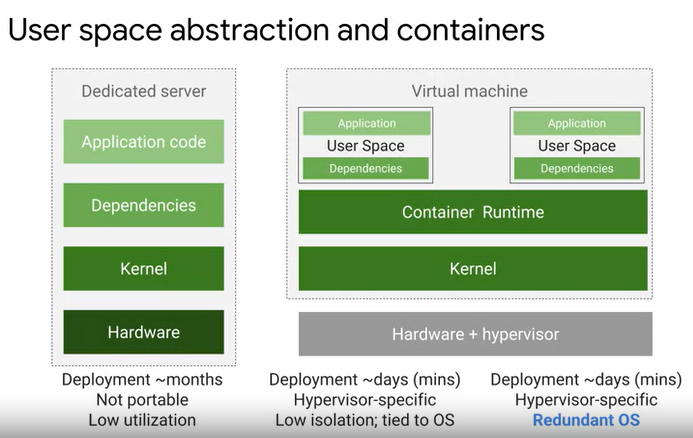
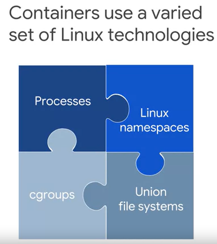
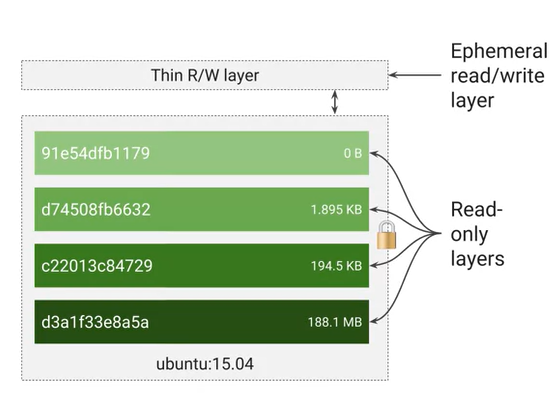
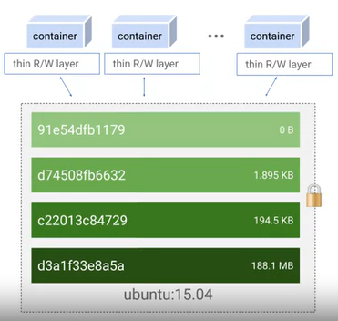
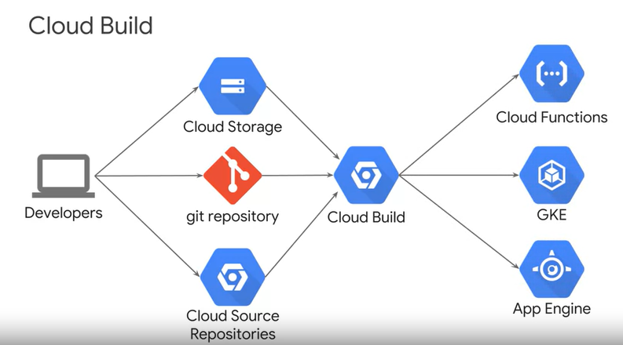
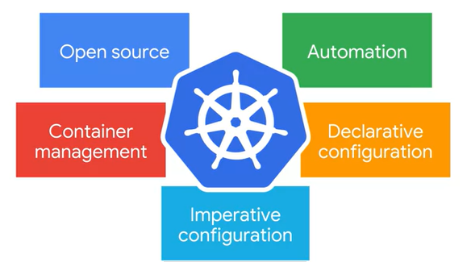
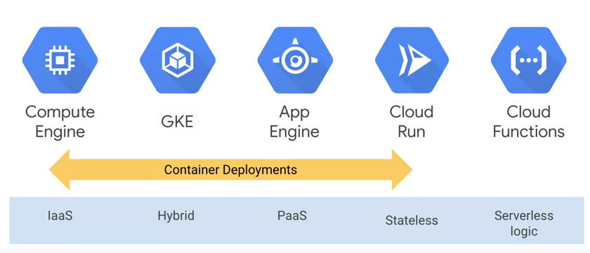

# Architecting with Google Kubernetes Engine:Foundation

## Containers and Container Images.

- Una forma eficiente de resolver el problema de dependencias es implementar abstracción a nivel de la aplicación y sus dependencias. Usted no debe virtualizar toda la máquina ni e sistema operativo completo sino solo el espacio de usuario. Este espacio es el código que reside en el kernel y que incluye las aplicaciones y sus dependencias. Esto es lo que significa crear contenedores. Son espacios aislados del usuario por código de aplicación en ejecución y son livianos porque no disponen de un sistema operativo completo y se programan o empaquetan en  el sistema subyacente el cual es muy eficiente.
   
   
   
   
- Un contenedor es simplemente una instancia de imágen en ejecución.

- Los contenedore no son una función intrínseca y básica de Linux. Por el contrario, su capacidad de aislar cargas de trabajo surge de la composición de distintas tecnologías. Una de ellas es el proceso de Linux. Cada proceso de Linux tiene su espacio de dirección de memoria virtual separado de todos los demás.

   

- Los contenedores estan estructurados en layers:

   

- Continers promote smaller shared images.

   

- Cloud build

   

## Introduction to Kubernetes.

- Kubernetes es una plataforma de código abierto  que lo ayuda a organizar y administrar  la infraestructura de sus contenedores de manera local o en la nube. 

- ¿Qué es Kubernetes?

  

- Kubernetes features:

  - Support both stateful and stateless applications.
  - Autoscaling.
  - Resource limits.
  - Extensibility.
  - Portability.

## Introduction to Google Kubernetes Engine.

- Explaining GKE features:

  - Fully managed.

  - Container-optimized OS.

  - Auto upgrade.

  - Auto repair.

  - Cluster scaling.

  - Seamless integration.

  - Identity and access management.

  - Integrated logging and monitoring.

  - GCP Console.

    

## GCP Computing Options in Detail

- Comparing GCP computing solutions.

  

- Compute Engine.

  - Fully customizable virtual machines.
  - Persistent disks and optional local SSDs.
  - Global load balancing and autoscaling.
  - Per-second billing.

- Compute Engine use cases.

  - Complete control over the OS and virtual hardware.
  - Well suited lift-and-shift migrations to the cloud.
  - Most flexible compute solution, often used when a managed solution is too restrictive.

- app Engine.

  - Provides a fully managed, code-first platform.
  - Streamlines application deployment and scalability.
  - Provides support for popular programming languages and application runtimes.
  - Supports integrated monitoring, logging, and diagnostics.
  - Simplifies version control, canary testing, and rollbacks.

- App Engine use cases.

  - Websites.
  - Mobile app and gaming backends.
  - RESTful aPIs.

- Google Kubernetes Engine.

  - Fully managed Kubernetes platform.
  - Supports cluster scaling, persistent disks, automated upgrades, and auto node repairs.
  - Built-in integration with GCP services.
  - Portability across multiple environments.
    - Hybrid computing.
    - Multi-cloud computing.

- GKE use cases.

  - Containerized applications.
  - Cloud-native distributed systems.
  - Hybrid applications.

- Cloud Run.

  - Enables stateless containers.
  - Abstracts away infrastructure management.
  - Automatically scales up and down.
  - Open API and runtime environment.

- Cloud Run use cases.

  - Deploy stateless containers that listen form requests or events.
  - Build applications in any language using any frameworks and tools.

- Cloud Functions.

  - Event-driven, serverless compute service.
  - Automatic scaling with highly available and fault-tolerant design.
  - Charges apply only when your code runs.
  - Triggered based on events in GCP services, HTTP endpoints, and Firebase.

- Cloud Functions use cases.

  - Supporting microservice architecture.
  - Serverless applicatin backends.
    - Mobile and IoT backends.
    - Integrate with thrid-party services and APIs
  - Intelligent applications.
    - Virtual assistant and chat bots.
    - Video and image analysis.

## Kubernetes Architecture.

