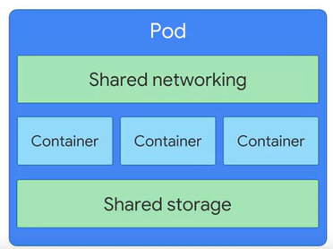

# Architecting with Google Kubernetes Engine:Foundation

​	**Fecha inicio:** 04/04/2020

​	**Fecha Fin:** 06/04/2020

## Containers and Container Images.

- Una forma eficiente de resolver el problema de dependencias es implementar abstracción a nivel de la aplicación y sus dependencias. Usted no debe virtualizar toda la máquina ni e sistema operativo completo sino solo el espacio de usuario. Este espacio es el código que reside en el kernel y que incluye las aplicaciones y sus dependencias. Esto es lo que significa crear contenedores. Son espacios aislados del usuario por código de aplicación en ejecución y son livianos porque no disponen de un sistema operativo completo y se programan o empaquetan en  el sistema subyacente el cual es muy eficiente.
   
   
   
   
- Un contenedor es simplemente una instancia de imágen en ejecución.

- Los contenedore no son una función intrínseca y básica de Linux. Por el contrario, su capacidad de aislar cargas de trabajo surge de la composición de distintas tecnologías. Una de ellas es el proceso de Linux. Cada proceso de Linux tiene su espacio de dirección de memoria virtual separado de todos los demás.

   

- Los contenedores estan estructurados en layers:

   

- Continers promote smaller shared images.

   

- Cloud build

   


## Introduction to Kubernetes.

- Kubernetes es una plataforma de código abierto  que lo ayuda a organizar y administrar  la infraestructura de sus contenedores de manera local o en la nube. 

- ¿Qué es Kubernetes?

  

- Kubernetes features:

  - Support both stateful and stateless applications.
  - Autoscaling.
  - Resource limits.
  - Extensibility.
  - Portability.

## Introduction to Google Kubernetes Engine.

- Explaining GKE features:

  - Fully managed.

  - Container-optimized OS.

  - Auto upgrade.

  - Auto repair.

  - Cluster scaling.

  - Seamless integration.

  - Identity and access management.

  - Integrated logging and monitoring.

  - GCP Console.

    

## GCP Computing Options in Detail

- Comparing GCP computing solutions.

  

- Compute Engine.

  - Fully customizable virtual machines.
  - Persistent disks and optional local SSDs.
  - Global load balancing and autoscaling.
  - Per-second billing.

- Compute Engine use cases.

  - Complete control over the OS and virtual hardware.
  - Well suited lift-and-shift migrations to the cloud.
  - Most flexible compute solution, often used when a managed solution is too restrictive.

- app Engine.

  - Provides a fully managed, code-first platform.
  - Streamlines application deployment and scalability.
  - Provides support for popular programming languages and application runtimes.
  - Supports integrated monitoring, logging, and diagnostics.
  - Simplifies version control, canary testing, and rollbacks.

- App Engine use cases.

  - Websites.
  - Mobile app and gaming backends.
  - RESTful aPIs.

- Google Kubernetes Engine.

  - Fully managed Kubernetes platform.
  - Supports cluster scaling, persistent disks, automated upgrades, and auto node repairs.
  - Built-in integration with GCP services.
  - Portability across multiple environments.
    - Hybrid computing.
    - Multi-cloud computing.

- GKE use cases.

  - Containerized applications.
  - Cloud-native distributed systems.
  - Hybrid applications.

- Cloud Run.

  - Enables stateless containers.
  - Abstracts away infrastructure management.
  - Automatically scales up and down.
  - Open API and runtime environment.

- Cloud Run use cases.

  - Deploy stateless containers that listen form requests or events.
  - Build applications in any language using any frameworks and tools.

- Cloud Functions.

  - Event-driven, serverless compute service.
  - Automatic scaling with highly available and fault-tolerant design.
  - Charges apply only when your code runs.
  - Triggered based on events in GCP services, HTTP endpoints, and Firebase.

- Cloud Functions use cases.

  - Supporting microservice architecture.
  - Serverless applicatin backends.
    - Mobile and IoT backends.
    - Integrate with thrid-party services and APIs
  - Intelligent applications.
    - Virtual assistant and chat bots.
    - Video and image analysis.


## Kubernetes Architecture.

- Para entender cómo funciona Kubernetes debe comprender dos conceptos relacionados.  El primero es el modelo de objeto de Kubernetes.  Cada elemento que Kubernetes administra  se representa con un objeto  y puede ver y modificar  estos objetos, atributos y estado.  El segundo es el principio de administración declarativa. Kubernetes espera que le diga  cuál es el estado que desea para los objetos administrados.

- Un objeto de Kubernetes  se define como una entidad persistente  que representa el estado de lo que se ejecuta en un clúster  su estado deseado y su estado actual.

- There are two elements to Kubernetes objects:

  

- Los pods son el pilar básico del modelo estándar de Kubernetes y son el objeto más pequeño de Kubernetes que se puede implementar.

  


## The Kubernetes Control Plane.

- En el siguiente esquema de describen todos los elementos de kubernetes:


## Google Kubernetes Engine Concepts.

- GKE administra todos los componentes del plano de control. Sigue exponiendo una dirección IP a la cual enviamos todas las solicitudes de la API de Kubernetes.  Pero GKE se hace responsable del aprovisionamiento y la administración  de toda la infraestructura de la instancia principal subyacente. También abstrae la necesidad de una instancia principal separada.
- Use node pools to manage different kinds of nodes.


## Kubernetes Object Management

- Objects are defined in a YAML file. Ejemplo:

  ```yaml
  apiVersion: apps/v1
  kind: Pod
  metadata:
  	name: nginx
  	labels:
  		app: nginx
  spec:
  	containers:
  	- name: nginx
  	  image: nginx:latest
  ```

  

- Podemos añadir labels:

  ```yaml
  apiVersion: apps/v1
  kind: Pod
  metadata:
  	name: nginx
  	labels:
  		app: nginx
  		env: dev
  		stack: frontend
  spec:
  	containers:
  	- name: nginx
  	  image: nginx:latest
  ```

  Podemos usar esas labels para tareas administrativas:

  ```bash
  $ kubectl get pods --selector=app=nginx
  ```

- Pods have a live cycle:

  

- Controller object types:

  - Deployment.
  - StatefulSet.
  - DaemonSet.
  - Job.

- Deployments ensure that sets of pods are running.

  ```yaml
  apiVersion: apps/v1
  kind: Deployment
  metadata:
  	name: nginx-deployment
  	labels:
  		app: nginx
  spec:
  	replicas: 3
  	template:
  		metadata:
  			labels:
  				app: nginx
  		spec:
  			containers:
  			- name: nginx
  	  		  image: nginx:latest
  ```

  

- Kubernetes le permite abstraer un único clúster físico en varios clústeres conocidos como espacios de nombres. Los espacios de nombres permiten asignar nombres a los recursos como pods, implementaciones y controladores.

  


## Kubernetes Controller Objects.

- Advanced objects: Service. Service is a set of Pods and a policy to access them with.

  Un servicio de Kubernetes es una dirección IP estática que representa un servicio  o una función en su infraestructura. Es una abstracción de red para un conjunto de pods que entrega ese servicio y oculta la naturaleza efímera de las direcciones IP de esos pods individuales.

  

- Advanced objects: Volume.

  - A directory that is accessible to all containers in a Pod.
  - Requirements of the Volume can be specified using Pod specification.
  - You must mount these Volumes specifically on each container within a Pod.
  - Set up Volumes using external storage outside of your Pods to provide durable storage.

- Services provide load-balanced access to specified Pods. There are three primary types of Services:

  - ClusterIP: Exposes the service on an IP address that is only accessible from within this cluster. This is the default type.
  - NodePort: Exposes the service on the IP address of each node in the cluster, at a specific port number.
  - LoadBalancer: Exposes the service externally, using a load balancing service provided by a cloud provider.

  In Google Kubernetes Engine, LoadBalancers give you access to a regional Network Load Balancing configuration by default. To get access to a global HTTP(S) Load Balancing configuration, you can use an Ingress object.

  


