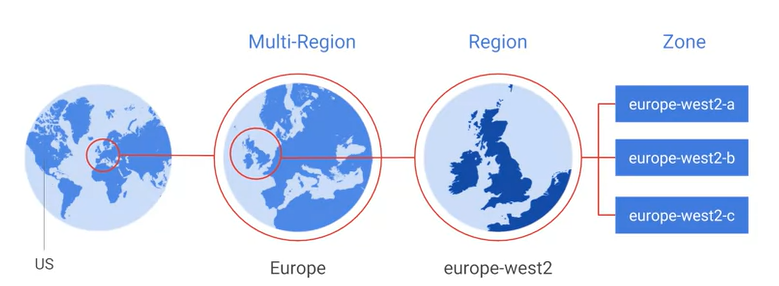
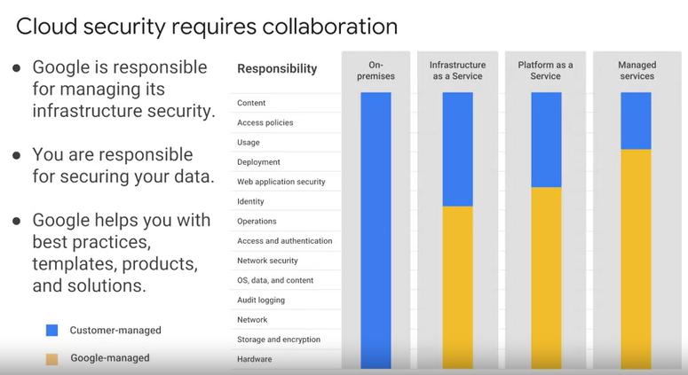
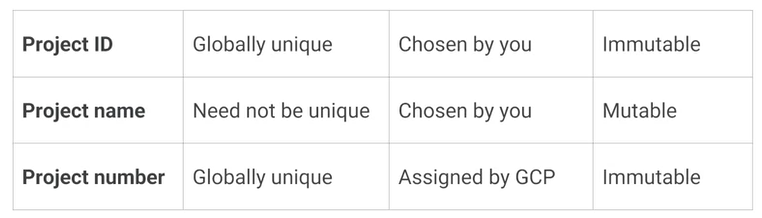
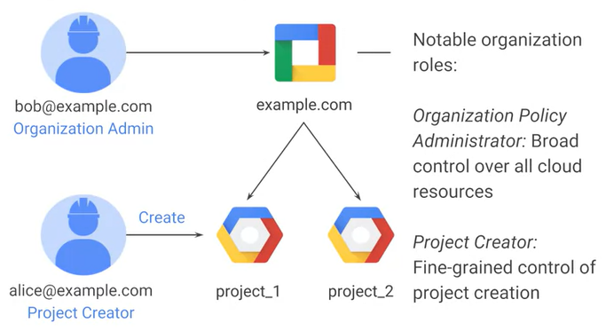
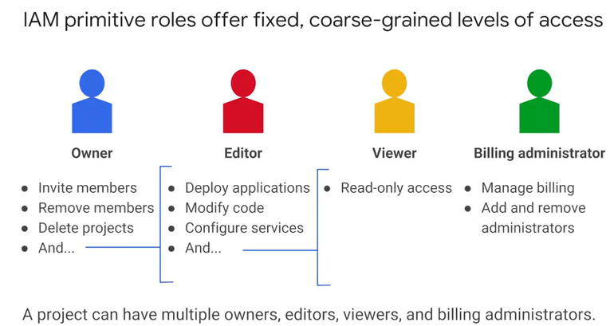
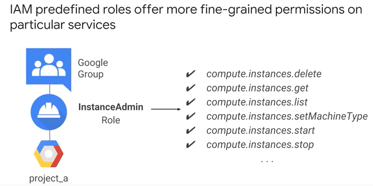
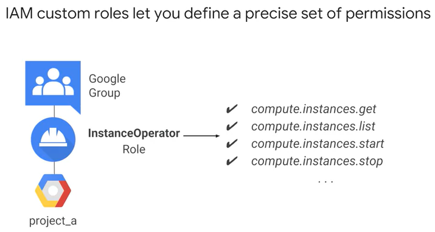
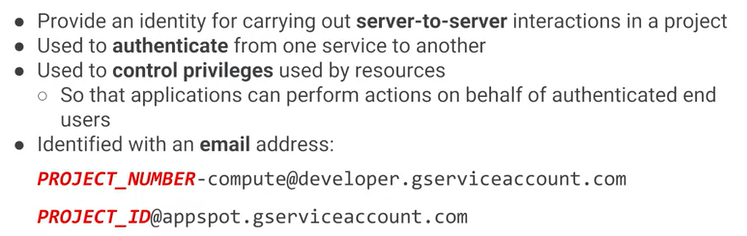

# Google Cloud Platform Fundamentals: Core Infrastructure.

**Fecha inicio:** 07/04/2020

**Fecha Final:**  

## Introducing Google Cloud Platform.

- Google Cloud Platform is organized into regions and zones.

  

## The Google Cloud Platform resource hierarchy.

- Hay cuatro maneras de interactuar con la capa de administración de GCP.  A través de la consola basada en la Web  con el SDK y sus herramientas de la línea de comandos  por medio de las API  y en una aplicación móvil.

  

- Projects have three identifying attributes:

  

- The organization node organizes projects.

  

## Identity and Access Management (IAM).

- There are three types of IAM roles:

  - Primitive. 

    

  - Predefined.

    

  - Custom.

    

- Service Accounts control server-to-server interactions.

  