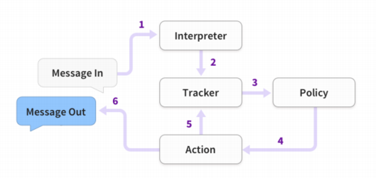

# Introducción a RASA.

Rasa es un framework Open Source que nos permitirá construir asistentes virtuales o chatbots con inteligencia artificial. Rasa tiene dos grandes módulos, Rasa NLU y Rasa Core. El módulo NLU se utilizará para entender los mensajes del usuario y el módulo Core se emplea para archivar las conversaciones y saber que función realizar después del usuario. Recientemente se ha presentado Rasa X, que es una herramienta para ayudar a mejorar el bot y la experiencia de usuario, ya que presenta una interfaz simple y sencilla de usar.

¿Por qué escoger Rasa? Algunas de las ventajas que nos ofrece frente a otras implementaciones son:

- Permite una instalación on-premise. 
- Al permitir una instalación local, los datos son del usuario permanecen almacenados en los servicios locales.
- Es altamente configurable ya que es Open Source.

## ¿Cómo funciona Rasa?

Rasa utiliza el siguiente flujo para responder a los mensajes que recibe como InPut:

1. El mensaje de entrada del usuario es recibido y enviado al “Interpreter”, el cual clasifica la frase y extrae las intenciones y las entidades obtenidas en el mensaje. Esto lo maneja el NLU. 
2. EL “Tracker” es el objeto que lleva a la conversación. Recibe información de que un mensaje nuevo ha entrado.
3. La “Policy” recibe el estado del tracker.
4. La “Policy” decide que acción realizar.
5. La acción es recibida y almacenada por el tracker.
6. La respuesta/acción se envía al usuario.

## Bibliografía.

- José Maria Gutierrez Siliceo, "DESARRROLLO DE CHATBOTS CON ENTORNOS DE CÓDIGO ABIERTO". Source: https://repositorio.unican.es/xmlui/bitstream/handle/10902/16456/418113.pdf?sequence=1&isAllowed=y
- 