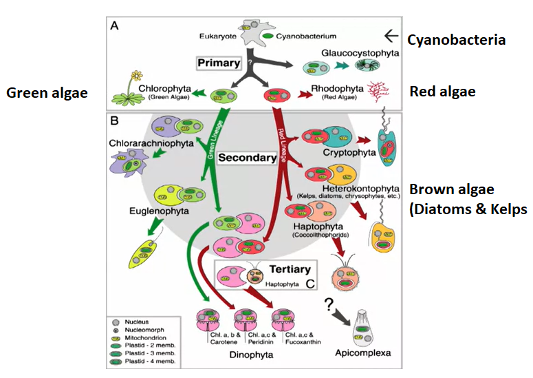
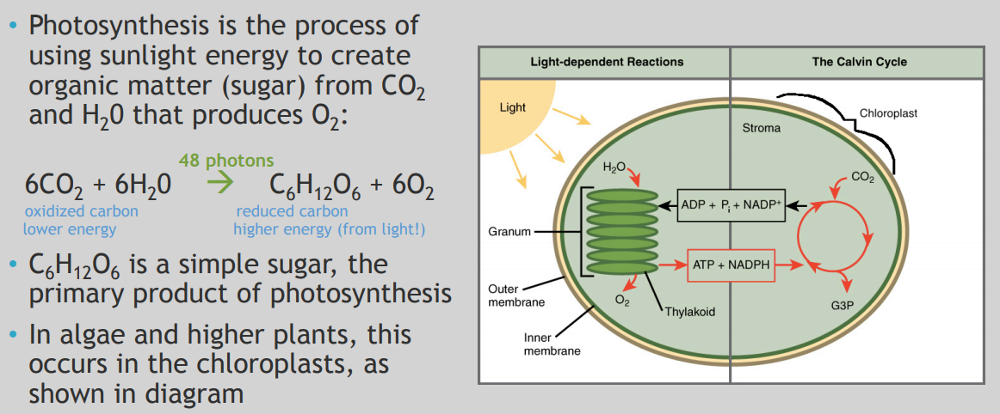
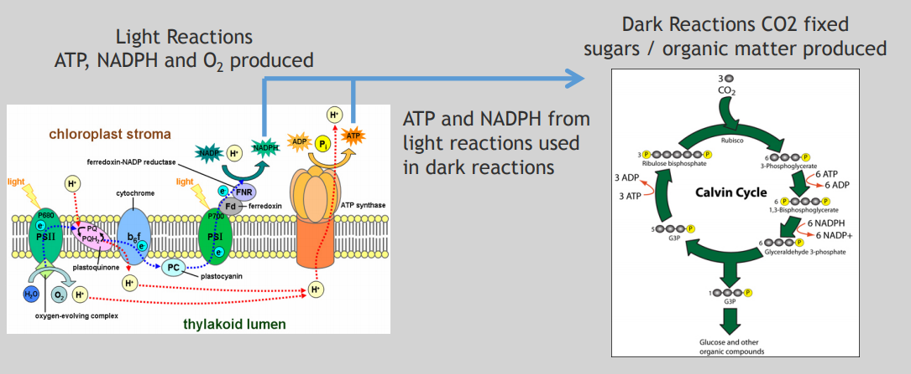
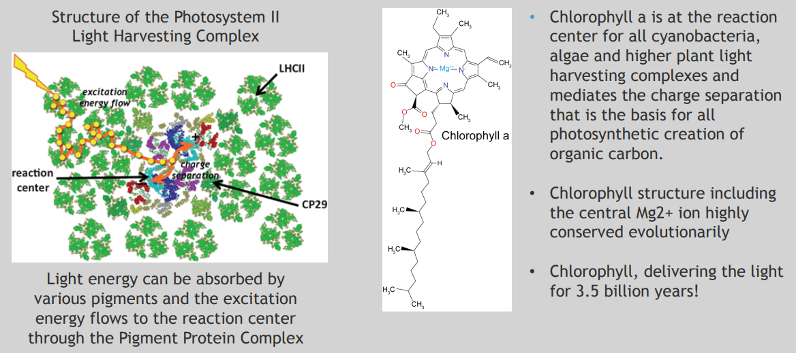
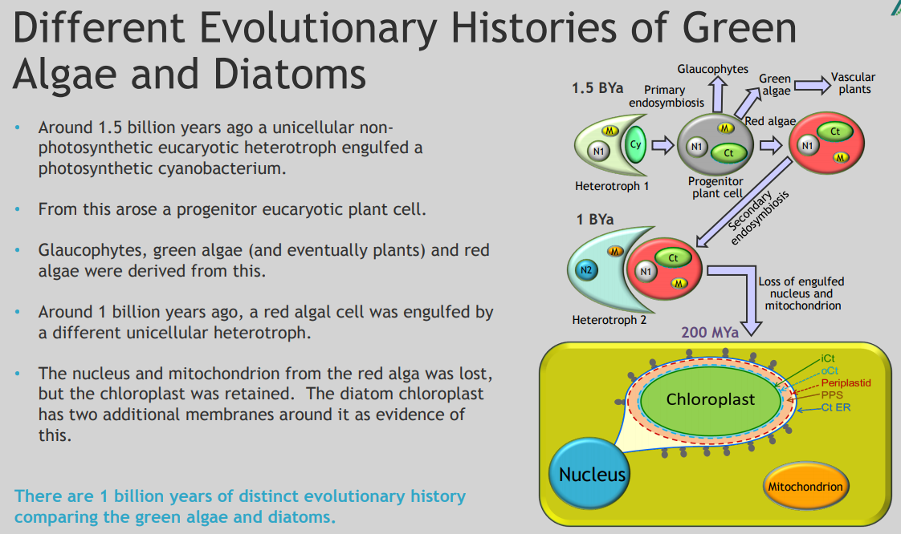
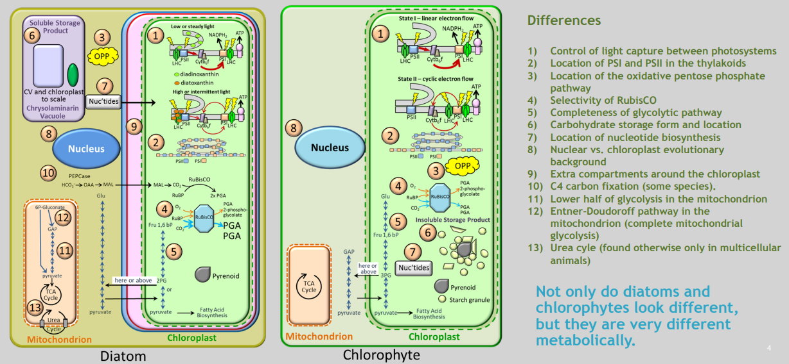
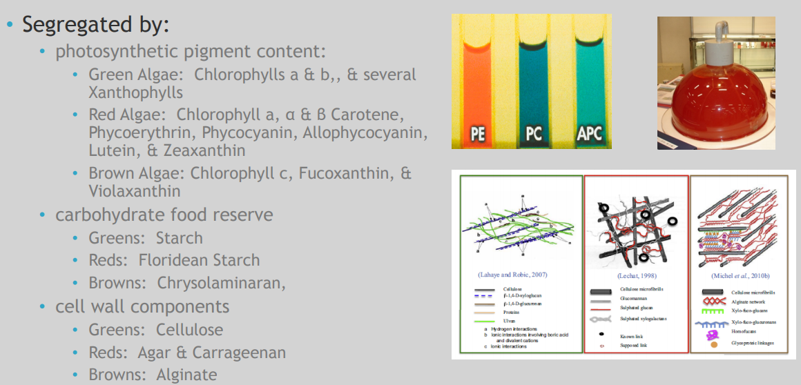
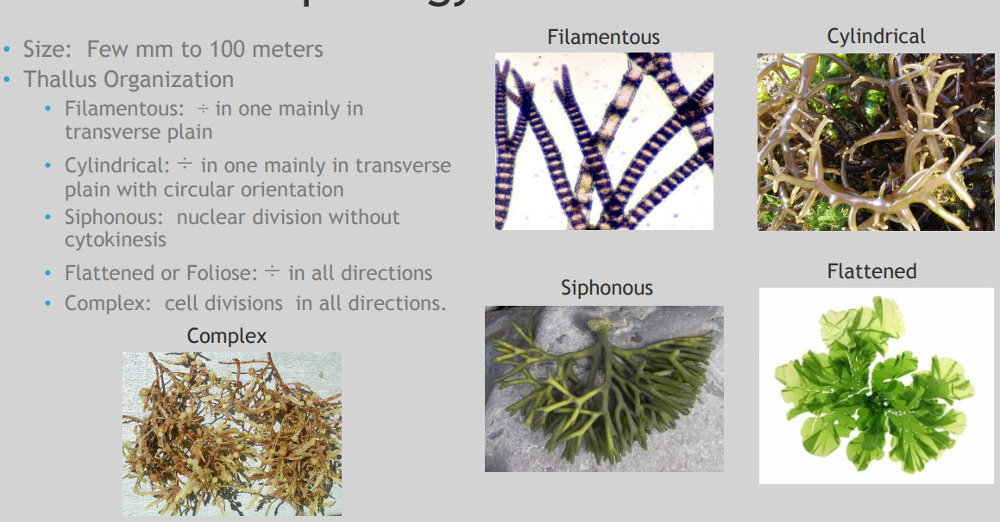

# Introduction to Algae.

## Week 1.

**What are algae?**

- Aquatic organisms that contain chlorophyll and carry on photosynthesis.
- Highly diverse:
  - micro-algae; single celled and multi-cellular.
  - Macro-algae, kelp and Seaweed.
- "algae" are eukaryotes.  We use the term "algae" to include both true eukaryotic algae and cyanobacteria.
- Cyanobacteria are photosynthetic bacteria.

**Macroalgae (Seaweed) Historical Utilization).**

- Uses: Medical, food, Feed, Fertilizer, Personal Care, Industrial, Nutraceuticals and Ecosystem Services.

**The Evolution and Diversity of Algae**

- Algae --> Highly diverse organisms including photosynthetic protists and Cyanobacteria. Traditionally classified by photosynthetic pigments.

- Endosymbiosis. A symbiotic relationship where one organism is permanently incorporated inside another. Primary endosymbiosis: Glaucophyta(blue), Rhodophyta(red) and Chlorophyta(green).

  

- Cyanobacteria. 5000 especies, Chlorophyll a and phycobilins. Some can fix N2 with specialized cells (heterocysts). Some can produce toxins (microcystins).
- Red algae (Rhodophyta). 7000 species. Mostly marine species. Chlorophylls a, d, and phycobilins. Cell wall made of cellulose embedded in gelatinous matrix.
- Green algae. 10.000 species. Mostly fresh water. Chlorophylls a, b. Some flagellated. Ancestor to all plants.
- Diatoms(Bacillariophyta). 50.000+ species. Found in all ecosystems. Chlorophylls a, c, fucoxanthin. Silica cell wall (SiO2). High oil content.
- Brown algae (Kelps). 2000 species. All multicellular, mostly marine. Chlorophylls a, c, and fucoxanthin. Cellulose cell wall with alginate. Largest sized algae (100ft+ long).

**Algae as a Photosynthetic Organism**

- different algae and cyanobacteria have different types of accessory pigments and UV protective pigments but all have chlorophyll-a.

- Photosynthesis can use less than half of the total solar energy spectrum, about 400-700 nm in the visible. This is called Photosynthetically Active Radiation (PAR).

- Various algae and cyanobacteria have different groups of pigments that are characteristic of different evolutionary lineages.

- Green algae and higher plants have chlorophylls a, b and beta-carotene.

- Photosynthesis at Cellular Scale.

  

- Photosynthesis at Molecular Scale.

  

  

## Week 2.

## Algal Diversity Part I: green Algae.

**What are they "green" algae?**

- Contain chlorophyll A and B making them green colored.
- From the division of Clorophyte and Charophyte.
- Plants are derived from Charophyte.
- Mainly fresh water (Ulvophyceae are marine).
- Multicellullar are possible.
- Have chloroplasts.

- Green alges have three Genomes: Chloroplast, Nucleus and Mitochondria. All are transformable.

## Algal Diversity Part II: Red Algae.

- Eukaryotic organisms.
- Mostly Multicellular et marine.
- Photosynthetic.
- Chlorophyll "a et d" containing.
- Lacking true roots, stem and leaves.
- Reproduction: sexual and asexual.
- Found in interdial to >300 meters deep.

- Anatomy:
  - Holdfast. Connects alga to hard surface with biological glues.
  - Stipe. Flexible and strong to maintain algal positional integrity in dynamic energy environments.
  - Blade. Undifferentiated "leaf-like" structure.
  - Frond or Thallus. Nearly the entire algal body is included in this structure.
  - Calcified. Calcium carbonate crystals incorporated in and on cell wall to afford great rigidity. 

## Algal Diversity Part III: Brown Algae and Diatoms.

- Substantial Metabolic Differences between Diatoms and Chlorophytes.

## Algal Diversity Part IV Macroalgae (Seaweed).

- Eukaryotic organisms
- Multicellular
- Photosynthetic 
- Chlorophyll “a” containing
- Predominantly marine 
- Lacking true roots, stems & leaves 
- Simple reproductive structures 
- Found from the intertidal zone to 300 meters

**Seaweed Diversity**

**Seaweed Morphology**

**Seaweed Anatomy**

## Algal Diversity Part V: Cyanobacteria.

- Prokaryotes.
- On earth for at leas 3,5 Billion years.
- Architects of our atmosphere.
- 