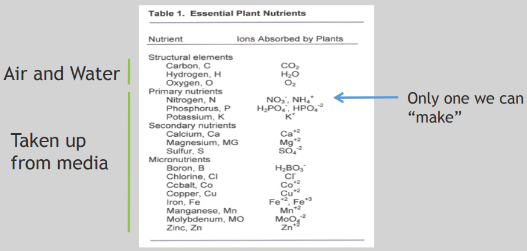

# Introduction to Algae.

## Week 1.

**What are algae?**

- Aquatic organisms that contain chlorophyll and carry on photosynthesis.
- Highly diverse:
  - micro-algae; single celled and multi-cellular.
  - Macro-algae, kelp and Seaweed.
- "algae" are eukaryotes.  We use the term "algae" to include both true eukaryotic algae and cyanobacteria.
- Cyanobacteria are photosynthetic bacteria.

**Macroalgae (Seaweed) Historical Utilization).**

- Uses: Medical, food, Feed, Fertilizer, Personal Care, Industrial, Nutraceuticals and Ecosystem Services.

**The Evolution and Diversity of Algae**

- Algae --> Highly diverse organisms including photosynthetic protists and Cyanobacteria. Traditionally classified by photosynthetic pigments.

- Endosymbiosis. A symbiotic relationship where one organism is permanently incorporated inside another. Primary endosymbiosis: Glaucophyta(blue), Rhodophyta(red) and Chlorophyta(green).

  

- Cyanobacteria. 5000 especies, Chlorophyll a and phycobilins. Some can fix N2 with specialized cells (heterocysts). Some can produce toxins (microcystins).

- Red algae (Rhodophyta). 7000 species. Mostly marine species. Chlorophylls a, d, and phycobilins. Cell wall made of cellulose embedded in gelatinous matrix.

- Green algae. 10.000 species. Mostly fresh water. Chlorophylls a, b. Some flagellated. Ancestor to all plants.

- Diatoms(Bacillariophyta). 50.000+ species. Found in all ecosystems. Chlorophylls a, c, fucoxanthin. Silica cell wall (SiO2). High oil content.

- Brown algae (Kelps). 2000 species. All multicellular, mostly marine. Chlorophylls a, c, and fucoxanthin. Cellulose cell wall with alginate. Largest sized algae (100ft+ long).

**Algae as a Photosynthetic Organism**

- different algae and cyanobacteria have different types of accessory pigments and UV protective pigments but all have chlorophyll-a.

- Photosynthesis can use less than half of the total solar energy spectrum, about 400-700 nm in the visible. This is called Photosynthetically Active Radiation (PAR).

- Various algae and cyanobacteria have different groups of pigments that are characteristic of different evolutionary lineages.

- Green algae and higher plants have chlorophylls a, b and beta-carotene.

- Photosynthesis at Cellular Scale.

  

- Photosynthesis at Molecular Scale.

  

  

## Week 2.

## Algal Diversity Part I: green Algae.

**What are they "green" algae?**

- Contain chlorophyll A and B making them green colored.
- From the division of Clorophyte and Charophyte.
- Plants are derived from Charophyte.
- Mainly fresh water (Ulvophyceae are marine).
- Multicellullar are possible.
- Have chloroplasts.

- Green alges have three Genomes: Chloroplast, Nucleus and Mitochondria. All are transformable.

## Algal Diversity Part II: Red Algae.

- Eukaryotic organisms.
- Mostly Multicellular et marine.
- Photosynthetic.
- Chlorophyll "a et d" containing.
- Lacking true roots, stem and leaves.
- Reproduction: sexual and asexual.
- Found in interdial to >300 meters deep.

- Anatomy:
  - Holdfast. Connects alga to hard surface with biological glues.
  - Stipe. Flexible and strong to maintain algal positional integrity in dynamic energy environments.
  - Blade. Undifferentiated "leaf-like" structure.
  - Frond or Thallus. Nearly the entire algal body is included in this structure.
  - Calcified. Calcium carbonate crystals incorporated in and on cell wall to afford great rigidity. 

## Algal Diversity Part III: Brown Algae and Diatoms.

- Substantial Metabolic Differences between Diatoms and Chlorophytes.

## Algal Diversity Part IV Macroalgae (Seaweed).

- Eukaryotic organisms
- Multicellular
- Photosynthetic 
- Chlorophyll “a” containing
- Predominantly marine 
- Lacking true roots, stems & leaves 
- Simple reproductive structures 
- Found from the intertidal zone to 300 meters

**Seaweed Diversity**

**Seaweed Morphology**

**Seaweed Anatomy**

## Algal Diversity Part V: Cyanobacteria.

- Prokaryotes.
- On earth for at leas 3,5 Billion years.
- Architects of our atmosphere.

## WEEK 3

## Algal Ecology

- What is ecology? Interactions among organisms and their environment that determine the kinds and numbers of species that we find.
- Why is ecology relevant to algae biotechnology?
  - Weeds, pests and diseases limit algae growth.
  - Diversity can increase production.

- Algae are the most productive 'plants' in the world.

  

- Algae interact with lots of other species: grazers, diseases, weeds.

  

- Ecological interactions can increase or decrease bioenergy productivity.

  - Colonization by wild pathogens, grazers, weeds.
  - Diversity can be managed to enchance yield.
  - Understanding ecology is key to success of algal bioenergy.

## Algae Predators, Pests, and Pathogens.

- Predators: primary producers are consumed by herbivores.

- Pathogens: terrestrial primary producers are susceptible to a variety of pathogens.

  

- we refer to predators and pathogens as pests because they essentially interfere with our ability to carry out agriculture. So, think of pests as an operational term, it's not an exact definition. In aquatic environments, algae and in this case microalgae are in fact also the primary producers and again at the center of the aquatic food web and there, they are also consumed by the secondary producers. We also collectively call these organisms grazers just as we do for the grazers of terrestrial plants. So, one of the important groups are protozoa. These are single-celled organisms that are capable of ingesting and grazing on a wide variety of algae, both filamentous and unicellular, both eukaryotic and prokaryotic. And there are three rather large groups of these kinds of protozoa that are important as predators of algae.

- Microalgal defenses against predators and pathogens.

  - Morphological.
    - Size (single cells→colonies, clumps)
    - Sheaths, spines, surface proteins
    - Thicker cell walls (to resist digestion)
  - Chemical
    - Toxins (Microcystins?, DMS), repellents
    - Life history effects on predator (hatching success, etc)

- One fascinating aspect is that certain microalgal defenses are in fact inducible. So algae know when predators are around and they've learned how to turn certain things on when these predators are around.
- Microalgal defensive traits can be selected for through natural selection and selective “breeding”.

- Selective “breeding” of microalgae:
  - Model systems of predator/prey or pathogen/alga that can be studied in the laboratory
  - Genetic tools to investigate and modify traits
  - Funding! In 2017, the USDA spent $194 million for research on crop protection (or 17% of its Research and Education Budget). There is nothing comparable for microalgae (yet!)

- Link: https://www.frontiersin.org/articles/10.3389/fmicb.2014.00278/full

- Contaminants in Algal Ponds

  

- Culture Crashes due to Predation, Infection, or Contamination

  

- lIntegrated Pest Management (IPM). Integrated Pest Management Systems are continuous so they are constantly monitoring for unproductive levels of predators and pathogens.

  

- Methods of Detection

  - Microscopy and Staining
    - Stains: Calcofluor white, Nile red, Congo red, etc. 
    - Automated Microscopy: CamFlow
  - Molecular Detection
    - Quantitative PCR (qPCR)
    - Hybridization (e.g., Phylochips)
    - Next Generation Sequencing
  - Spectroscopy
    - Hyperspectral Imaging/Reflectance
  - Mass Spectrometry

- Intervention and Control Systems
  - Salvage Harvest
  - Chemical Agents
    - Abscisic acid
    - Fungicides
    - pH controls
    - Ammonia Exposure
  - Physical Methods
    - Sonication
    - Filtration
  - Biological Methods
    - Breeding or Modification
    - Predators of parasites
    - Polycultures

## WEEK 4

## Algae as an Industrial Organism

-  what is bio-manufacturing? We can define that as the use of living systems or organisms to develop and make products, useful products.

- Algae bio-manufacturing can produce a wide spectrum of products:

  

- Microalgae Production.

  

## Production of Phototropic Microalgae.

- **Definitions**:

  - *Phototrophic*… Photo = light trophic = attracted to

  - *Synonyms:* phototroph or photoautotroph

  - *Phototrophs include:* all terrestrial plants, aquatic and marine algae (both microalgae = phytoplankton, and macroalgae = seaweeds), and photosynthetic bacteria, e.g. cyanobacteria (or,
    “bluegreen algae”)

  - *Phototrophic microorganism*: is a microorganism that uses light energy to manufacture its own food (e.g., sugars) from inorganic compounds (primarily CO2 and H2O).

  - *Phototrophs* require nitrogen (N) and phosphorus (P) & other trace elements for their growth and productivity.

    

## Production of phototropic Microalgae.

- Definitions:

  - **Heterotrophic:** An organism that cannot manufacture its own food and instead obtains its food and energy by taking in and utilizing organic substances.
  - **Synonyms:** heterotroph
  - **Heterotrophic:** An organism that cannot manufacture its own food and instead obtains its food and energy by taking in and utilizing organic substances. • Synonyms: heterotroph • Heterotrophs include: all animals, protozoan, fungi, most bacteria, some aquatic and marine algae, and some cyanobacteria 
  - **Heterotrophs:** require nitrogen (N), phosphorus (P), other trace elements and oxygen for their growth and productivity • Aerobic Fermentation: Production of heterotrophic algae in the presence of O2 all animals, protozoan, fungi, most bacteria, some aquatic and marine algae, and some cyanobacteria
  - **Heterotrophs**: require nitrogen (N), phosphorus (P), other trace elements and oxygen for their growth and productivity.
  - Aerobic Fermentation: Production of heterotrophic algae in the presence of O2.

- Differences between phototrophic and herterotrophic growth processes:

  

- How heterotrophic Algae Metabolize Organic Carbon.

  

## Microalgae(Seaweed).

- Gracilaria “Ogo” Cultivation.
- Kappaphycus and Eucheuma.
- Philippines Farming.
- Sugar Kelp Farming - Coastal Waters of Maine.

## WEEK 5. Algae Biomanufacturing Part 2.

## **Measuring Culture Growth**

- Typical growth of microalgae cultures.

  

  This shows the density of the culture over time. Cultures begin when we inoculate fresh medium at a low density and the cells may take some time to adjust to this new environment, so there is initial lag phase. This lag phase is followed by a period of rapid growth where cell division is at its highest and resources are being rapidly consumed. As these resources are consumed, something eventually becomes limiting to the culture stopping growth and divisions. This limitation sends the culture into what we call a stationary phase. And if the stationary phase persists long enough, cells will begin to die off or go into a resting stage waiting for the environment to get better. So understanding this basic growth curve is very important because we want to be asking ourselves, "What stage is my culture at as we're culturing algae?" So the first thing we can do to understand what stage it's at, is to quantify the biomass inside the culture. This is done by measuring the amount of dry weight that's inside of our culture.

  

  ## Nutrient Utilization and Recycling

- A nutrient is defined as an element that is essential for growth and maintenance of life.

- Nutrientes used in all photosynthetic organisms.

  

- Macro-nutrientes are essential for algal growth.

  - N-Nitrogen
    - Proteins
    - Nucleic Acids
    - Chlorophyll
  - P-Phosphate.
    - Nucleic Acids.
    - ATP
    - Phospho-proteins
  - K-Potassium.
    - Key cellular Ion
    - Osmotic regulation

- Nitrogen fixation with nitrogenase.

  - Happens in roots of legumes and in some cyanobacteria

  - Requires ATP and Reduced Ferrodoxin – poisoned by Oxygen

    

## Harvesting and Dewatering

- Harvesting and dewatering is a key step in the algae production process.

  

- Key harvest technology attributes

  - High harvest efficiency (algae, bacteria, and predators)
    - Maintains pond quality
    - Prevents resistance to harvesting technology
  - High product quality
    - Low shear
    - Avoid addition of flocculants or chemicals
  - High outlet concentration (15-30%)
  - Harvest any microalgae
  - Low energy use (<0.2 kWh/m3)
  - Low chemical costs
  - Scalable to millions of gallons per day

- there's basically three technologies that have been used at large scale for harvesting dewatering that go all the way from pond concentration up to the final dewatered concentration of 15 to 30 percent solids. The most common historically has been the centrifuge, and that's just using centrifugal forces, and you have plates in a centrifuge that spin, and they throw the algae cells to the outside, and the water is discharged through the middle, and they are basically, physically, separating that by again density differences. Disadvantages of that approach are its very high shear, and its very high energy consumption, and you don't get a 100 percent separation. Some of the algae cells end up not having high enough density differences, or if your media is sailing, that leads to lower density differences between the algae and the media, and so you get cases where some of the algae bypasses and is returned back to the pond. Screens have been used primarily for spirulina, it's good for filamentous algae which will collect and this is a picture of a spirulina collected on a screen. That's an effective means of harvesting gets most of the algae don't return too much, but it does not remove other algae other than the filamentous, and it does not remove bacteria, or other predators, and so you are recycling those back to the ponds. But it's been used for a long time in spirulina production. And then more recently the Zobi Harvester has been developed. That is a dead end filtration technology that allows you to get the high concentration, and has a very fine poor size cut off, and so, the cut off is about 0.04 Microns. So it harvests all the bacteria algae and predators, and provides crystal clear return water to the system. Then there are a number of technologies that would require two stages in order to harvest. So, the first stage or the primary harvesting is done and it takes the concentration from say pond concentrations of point zero five percent solids up to about one percent solids. 

  

