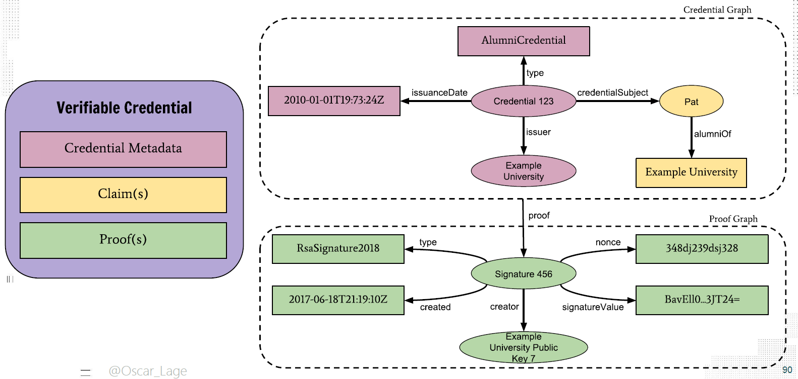
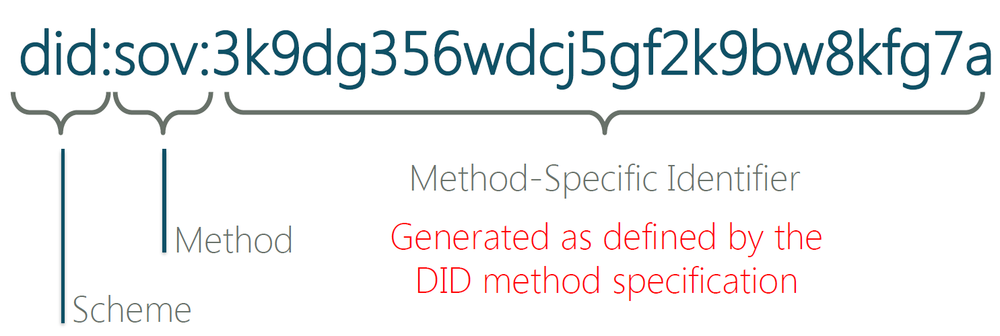
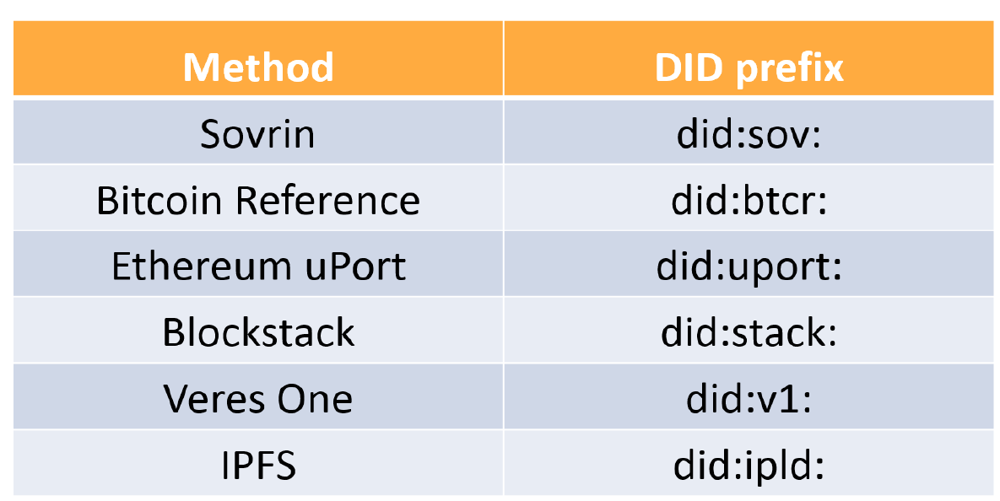
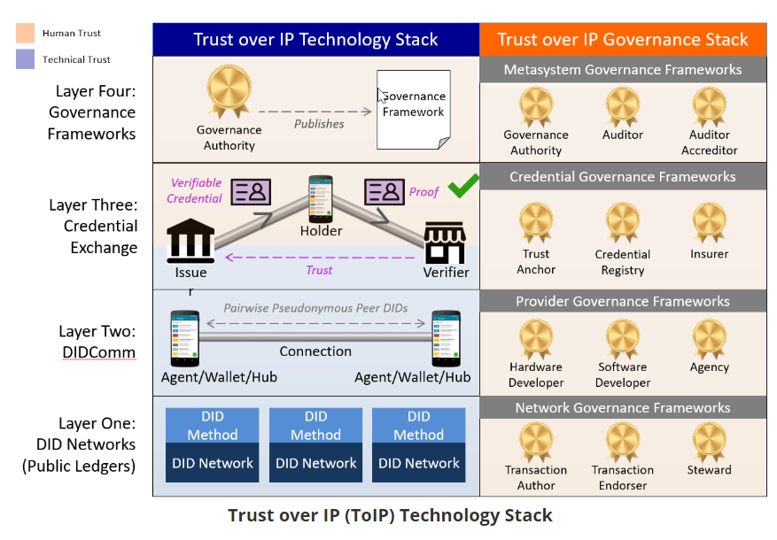
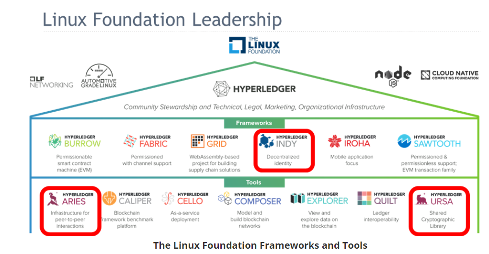

# Introduction to Hyperledger Sovereign Identity Blockchain Solutions: Indy, Aries & Ursa

**Fecha inicio:** 06/04/2020

**Fecha final:**

## Chapter 1: Something is missing.

- **unwanted Correlation.** The use of common identifiers on so many different sites creates what is known as a correlation problem. Correlation in this context means associating without consent information about a single identity across multiple systems. The proliferation of this kind of correlation on the Internet, driven primarily by advertising, has resulted in a massive loss of privacy for Internet users (basically, everyone). The Identity Providers (IdPs) model is also a correlation point—although in this case, one given with consent. The IdP approach trades convenience (fewer user IDs and passwords) for correlation. Since the IdP is used for each login, the IdP can track your use of other sites and thus correlate your online activities, increasing their knowledge of you.
- **Data Breaches**
- **Centralized Identifiers.** 
- A **credential** is an attestation of qualification, competence, or authority issued to an entity (e.g. an individual or organization) by a third party with a relevant or de facto authority or assumed competence to do so. The paper credential model(ideally) proves:
  - Who issued the credential.
  - Who holds the credential.
  - The claims have not been altered.

## Chapter 2: The Verificable Credentials (VC) Model.

- The Hyperledger projects, Indy, Aries and Ursa, which we will talk about in upcoming chapters, are tools and libraries that allow for the development of independent digital identities rooted on blockchains or other distributed ledgers. They help bring about the possibility of building applications with a solid digital foundation of trust by enabling the **verifiable credentials model**.
- The verificable credentials model is:
  - An authority decides you are eligible to receive a credential and issues you one.
  - You hold your credential in your (digital) wallet.
  - At some point, you are asked to prove the claims from the credential.
  - You provide a verifiable presentation to the verifier, proving the same things as with a paper credential.
  - You can prove that the issued credential has not been revoked.
- Attributes of all credentials:
  - Who issued the credential.
  - The credential was issued to the entity presenting it.
  - The claims were not tampered with.
  - The credential has not been revoked.

- In essence, verifiable credentials are digital, cryptographically-protected data that you can use to prove you are you! With Indy, the data can be used by their holder to generate cryptographic zero-knowledge proofs (ZKPs).
- Referring to the following illustration from the World Wide Web Consortium (W3C), there is an **issuer**, a **holder** and a **verifier**, just like in the paper credentials model. Unlike the paper credential model, which depends on the skill of the verifier to recognize an altered or forged credential, the verifiable credentials model includes a **verifiable data registry**—most importantly cryptographic keys and identifiers—that enables the proving of the data. That’s the blockchain part of verifiable credentials.

- Compared to the paper credentials model, verifiable credentials are far more secure. The verifier is not a person trying to identify a forged document. Instead, if the cryptographic verification succeeds, the verifier can be certain of the validity of the data.

- A proof is evidence of the claim (for example, a birth certificate, passport or driver’s license, or in the case of a business, incorporation papers)

- The verifiable credential model has other important ramifications:

  - Your verifiable credentials are issued to you, stored in your digital wallet, and you decide when and where you want to use them. That improves your privacy—you are in control of when and with whom you share your information.
  - Verifiable presentation data is proven without needing to call back to the issuer.
  - Verifiable credentials go beyond identity to enable the digitization of almost any paper-based verification process.

  

#### # What is Self-Sovereign Identity?

- SSI is the idea that you control your own data, you control when and how it is provided to others, and when it is shared, it is done so in a trusted way. With SSI, there is no central authority holding your data that passes it on to others upon request. And because of the underlying cryptography and blockchain technology, SSI means that you can present claims about your identity and others can verify it with cryptographic certainty.

- SSI is not about you self-asserting information about yourself and demanding that everyone else accept it as fact.

- Drummond Reed, identity guru and Founding Trustee of the Sovrin Foundation, describes self-sovereign identity as:

  > "*Lifetime portable identity for any person, organization, or thing that does not depend on any centralized authority and can never be taken away.*"

- The ten Principles of SSI:
  1. Users must have an independent existence.
  2. Users must **control their identities**.
  3. Users must have access to their own data.
  4. Systems and algorithms must be **transparent**.
  5. Identities must be long-lived.
  6. Information and services about identity must be **transportable**.
  7. Identities should be as **widely used** as possible.
  8. Users must agree to the use of their identity.
  9. Disclosure of claims must be minimized.
  10. The **rights of users** must be protected.

**AMPLIACIÓN:**

Principios SSI:

- Existencia.
  - La identidad auto-soberana se basa en última isntancia en el "yo".
  - La SSI simplemente hace públicos y accesibles algunos aspectos limitados del "yo".
- Control.
  - Los usuarios deben controlar su propia identidad.
  - El usuario debe poder utilizarla, actualizarla e incluso acultarla.
- Acceso.
  - Los usuarios deben tener acceso a sus propios datos.
  - El usuario debe recuperar fácilmente todas las atribuciones y datos de su identidad.
- Transparencia. 
  - Los sistemas y algoritmos deben ser transparentes y abiertos.
  - Los algoritmos deben ser libres, de código abierto, conocidos y tan independientes como sea posible.
  - Cualquier persona debe poder auditar el funcionamiento.
- Persistencia.
  - Las identidades deben ser duraderas, preferiblemente para siempre o el tiempo que el usuario desee. Aunque se actualicen las claves y los datos la identidad debe poder perdurar.
  - Esto debe ser compatible con el "derecho al olvido", los atributos deben poder modificarse o eliminarse.
- Portabilidad.
  - La información y los servicios sobre la identidad deben poderse transportar.
  - Las identidades no deben estar en manos de terceros aunque sean confiables. Las entidades pueden desaparecer los usuarios cambiar de jurisdicción...
  - La portabilidad garantiza el control de la identidad pase lo que pase, así como la persistencia a lo largo del tiempo.
- Interoperabilidad.
  - La identidades tienen poco valor si sólo funcionan en determinados nichos.
  - El objetivo es la disponibilidad global bajo el control del usuario.
  - Gracias a la persistencia y autonomía, las identidades estarán disponibles de forma continua.
- Consentimiento.
  - Los usuarios deben aceptar el uso de su identidad.
  - El intercambio de datos sólo debe realizarse con el consentimiento del usuario. Aunque terceros (empresa, financiero, personas) puedan presentar atributos el usuario debe ofrecer su consentimiento.
  - El consentimiento puede no ser interactivo, pero debe ser debilerado y bien entendido.
- Minimización.
  - La divulgación de atributos y datos debe ser la mínima necesaria para llevar a cabo la tarea en cuestión.
  - Utilizar pruebas de rango(tipología de ZKP): si se exige una edad mínima no se revela la edad, y si se requiere una edad no se revela la fecha de nacimiento precisa.
  - La correlacionabilidad sigue siendo un reto, la divulgación selectiva y las ZKP ayudan pero deberemos ser siempre cuidadosos y minimizar la información.
- Protección.
  - Los derechos de los usuarios deben ser protegidos.
  - Si existe un conflicto entre las necesidades de la red y los derechos individuales se deben preservar las libertades y derechos del individuo.
  - La autenticación se debe realizar mediante algoritmos independientes resistentes a la censura, la fuerza y ejecutados de forma descentralizada.

####  What Are Decentralized Identifiers?

- While verifiable credentials are an important component of SSI, a thing called a **decentralized identifier** (DID) is a key enabler for verifiable credentials. DIDs are a new type of identifier that is in the process of becoming a World Wide Web Consortium (W3C) [standard](https://www.w3.org/2019/did-wg/). (https://w3c.github.io/did-core/)
- DIDs are a special kind of identifier that are created by their owner, independent of any central authority. Per the DID specification, a DID looks like the following and is similar to an HTTP address but used differently.
- DIDs are:
  - A new type of uniform resource location (URL).
  - Created by anyone at anytime.
  - Globally unique.
  - Highly available.
  - Cryptographically verifiable.

- With a DID, you can:
  - Resolve a DID to get a DIDDoc.
  - Within the DIDDoc, find a public key and an endpoint for the entity that controls the DID.
  - Use the endpoint to send a message to that entity.
  - In the message, ask them for proof they have the private key related to the public key.
  - Receive back that proof.
  - Verify that proof.

**AMPLIACIÓN:**

- Un DID debe ser:
  - Permanente
  - Resolvible.
  - Verificable criptográficamente.
  - Descentralizado.

- Métodos estandarizados:

  

#### Zero-Knowledge Proof

- A **zero-knowledge proof** ([ZKP](https://en.wikipedia.org/wiki/Zero-knowledge_proof)) is about proving attributes about an entity (a person, organization or thing) without exposing a correlatable identifier about that entity. Formally, it’s about presenting claims from verifiable credentials without exposing the key (and hence a unique identifier) of the proving party to the verifier. A ZKP still exposes the data asked (which could uniquely identify the prover), but does so in a way that proves the prover possesses the issued verifiable credential while preventing multiple verifiers from correlating the prover’s identity. 
- There are other types of verifiable credentials that do not use a ZKP-based approach. In a non-ZKP proof, the holder/prover proves control over a DID to an issuer, and the issuer embeds that DID in the issued credential. Later, a verifier extracts the that DID from the credential and has the holder/prover prove they (still) control that DID. This proves the the credential was issued to the holder. Thus, a non-ZKP proof includes a public DID for the issuer (as with the Indy ZKP model) and a public DID for the holder/prover (unlike Indy). Usually in the non-ZKP model, the entire credential (with the embedded DIDs) is cryptographically signed by the issuer (proving the claims and the DIDs).

#### Selective Disclosure

- The Indy ZKP model enables some additional capabilities beyond most non-ZKP implementations. Specifically, that claims from verifiable credentials can be selectively disclosed, meaning that just some data elements from credentials, even across credentials can (and should be) provided in a single presentation. By providing them in a single presentation, the verifier knows that all of the credentials were issued to the same entity. In addition, a piece of cryptography magic that is part of ZKP (that we won’t detail here—but it’s fascinating) allows proving pieces of information without presenting the underlying data.

#### Agents and Wallets

- A third key component of SSI, along with verifiable credentials and DIDs, is the software that you use to process verifiable credentials and DIDs—what we’ve called your digital wallet.
- Indy, Aries and Ursa use the term **agent** to mean the software that interacts with other entities (via DIDs and more, as we'll find out).
- All agents (with rare exceptions) have secure storage for securing identity-related data including DIDs, keys and verifiable credentials. As well, all agents are controlled to some degree by their owner, sometimes with direct control (and comparable high trust) and sometimes with minimal control, and far less trust.

#### Trust Over IP (ToIP)

- ToIP is a set of protocols being developed to enable a layer of trust on the Internet, protocols embodied in Indy, Aries and Ursa. It includes self-sovereign identity in that it covers identity, but goes beyond that to cover any type of authentic data. Authentic data in this context is data that is not necessarily a credential (attributes about an entity) but is managed as a verifiable credential and offers the same guarantees when proven.

  ToIP is defined by the "Trust over IP Technology Stack," as represented in this image from Drummond Reed:

  

- At the bottom left, the foundation of the stack are public blockchains that store decentralized identifiers (DIDs) and (in some cases) other data necessary for the higher layers. Next are agents and the protocols that enable agents to establish connections and exchange messages (information). The next layer up is the verifiable credential layer that enables trusted information flow—data cryptographically signed by the participants during issuing and verified during presentation. Note the coloring of the layers on the left side: "technical trust" (shown in blue) is enabled by the cryptography and "human trust" (shown in pink) is enabled by the governance frameworks.
- That top layer, and the associated governance frameworks on the right, are the rules that the participants in the network agree to use to enable the system to work in practice. Example governance frameworks include the following topics we’ll cover in this course:
  - How the readers and writers of the blockchain operate.
  - How the agents know meaning of messages that form a protocol.
  - What the claims in credentials signify to the verifier.
  - By what authority an issuer is able to issue a credential.

## Chapter 3: SSI Using Indy, Aries and Ursa.

- [Hyperledger Indy](https://www.hyperledger.org/projects/hyperledger-indy) was Hyperledger’s first "identity-focused" blockchain framework, joining Hyperledger in 2017. The code for Indy was contributed by the Sovrin Foundation, an organization that we’ll cover a little later, after we’ve dug a bit deeper into Indy. Indy is a purpose-built distributed ledger for decentralized identity. Indy includes verifiable credentials based on zero-knowledge proof (ZKP) technology, decentralized identifiers, a software development kit (SDK) for building agents and an implementation of a public, permissioned distributed ledger.

- In 2018, the decision was made to migrate the ***\*indy-crypto\**** code repository out of Indy and into its own project: [Hyperledger Ursa](https://www.hyperledger.org/projects/ursa). Ursa packages the primitives in a way that can be consumed by Indy, Aries and any other software that needs a solid, vetted cryptographic base.

  

-  [Hyperledger Aries](https://www.hyperledger.org/projects/aries) is a toolkit designed for initiatives and solutions focused on creating, transmitting, storing and using verifiable digital credentials. At its core are protocols enabling connectivity between agents using secure messaging to exchange information. Aries is all about peer-to-peer interactions between agents controlled by different entities—people, organizations and things. Using the standardized messaging channel, verifiable credentials can be exchanged based on DIDs rooted in different ledgers (based on Indy or other technology) using a range of verifiable credentials implementations.

  

- Together, Indy, Aries and Ursa make the Hyperledger Identity "Stack."

#### DEMO time.

Link: https://github.com/cloudcompass/ToIPLabs/blob/master/docs/LFS172x/running-aries-browser-lab.md

**Hyperledger Indy, Aries, Ursa Agent Demostration**

LINK: https://github.com/cloudcompass/ToIPLabs/blob/master/src/indy-material/nodejs/README.md

#### Hyperledger URSA

- The Hyperledger Ursa project produces cryptographic packages that can be used to build higher level applications. The packages Ursa produces are used by Indy and Aries for all of the uses of cryptography by those projects, including:
  - generation of public/private key pairs
  - data encryption and decryption
  - data signing and verifying
  - data hash generation and verification
  - zero-knowledge proof (ZKP) technology, including issuing ZKP credentials and generating and verifying ZKPs

  These capabilities are used throughout Indy and Aries, as we will see when we get deeper into these projects.

- 